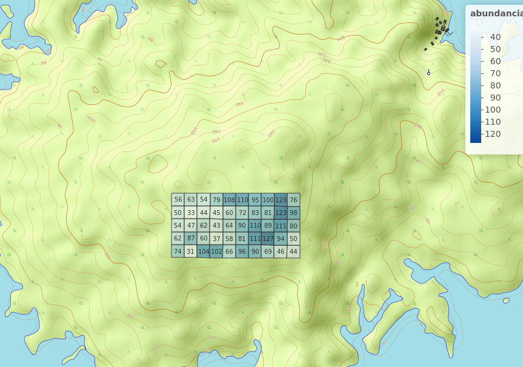
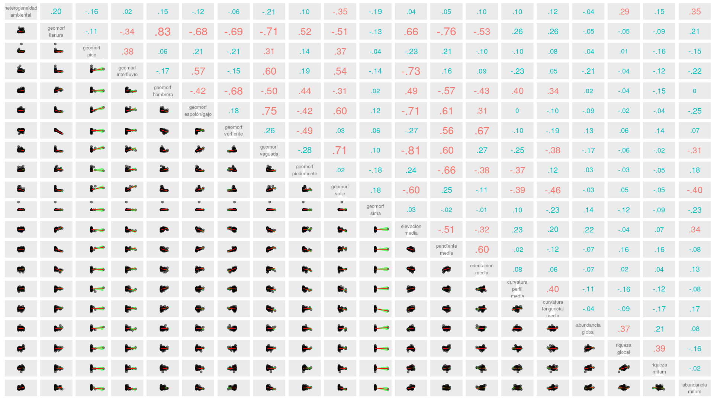
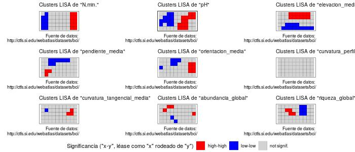
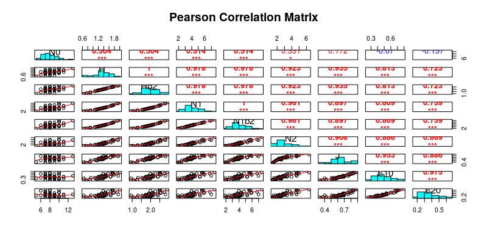
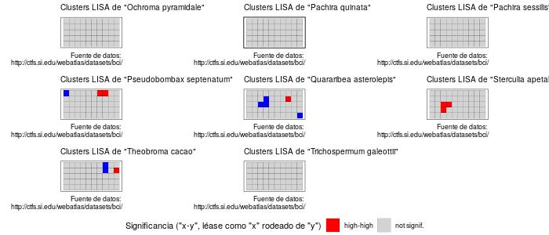

# Introducción
La isla Barro Colorado (BCI) es un área natural localizada en el lago Gatún del canal de Panamá que los cientificos la han dedicado al estudio de bosques tropicales, de fauna y flora. Desde su creación ha sido usada como centro de investigación, útil para hacer proyectos de investigación. 

Cuenta con una vegetación de bosque tropical húmedo semi-perenne, propio de climas húmedos tropicales. La mitad de la isla se encuentra cubierta de bosque jóven de 100 o más años de edad, el resto está cubierto de bosque viejo, el cual ha sufrido muy pocas perturbaciones en los últimos 400 años {moreno2012ambito}. Se caracteriza un promedio anual de temperatura de 27$^{\circ}$ C en áreas abiertas, con una variación diurna de 9$^{\circ}$ C. Tiene una precipitación promedio anual es de 2,600 mm, con una estación lluviosa que va de mayo a diciembre, y una estación seca que comprende los meses restantes. Está constituida por un total de 265 especies de plantas, y cada una pertenece a una familia.Su flora es considerablemente más rica en relación con el tamaño de la isla{croat1978flora}. 

Dentro de su amplia variedad de familias de plantas se encontran las Malvaceae. Esta perteneciente a la familia de las Malvales, con flores dicotiledóneas, que consta de aproximadamente 244 géneros con aproximadamente 4225 especies, distribuidas en regiones tropicales a templadas.

Son plantas de hierbas, arbustos o árboles, generalmente con pelos estrellados. Los tallos son de fibra de líber robusta con cavidad de mucílago. Las hojas son simples, alternas,  palmadamente divididas, palmadas veteadas, con estípulas y pecioladas. Las flores son actinomórficas, solitarias, fasciculadas o dispuestas en cimas o panículas con sépalos de 3 a 5, libres o connatos y valvados. Los pétalos son cinco, libres, giratorios, adnados a la columna estaminal en la base. Los estambres son numerosos, filamentos connados en tubos, conocidos como adelfos {xu2017malvaceae}.(ver figura 1)

{width=30%}

El objetivo de este estudio es identificar la abundancia y la riqueza de esta familia de plantas; analizar su asociación y que influye para que se de dicha asociación. Conocer el método más eficiente para evaluar los dendogramas, evaluar la homogeneidad de promedios entre sitios de especies. De igual manera identificar el patrón y los factores ambientales que intervienen en su distribución. Finalmente integrando la ecología numérica analizar la autocorrelación espacial entre variables. 

La mayor parte del trabajo de se desarrolló en entorno al lenguaje de programación R, en el cual se efectuaron los análisis de agrupamientos, ambientales,ordenamiento y de ecología numérica, apoyandose con paquetes como tidyverse junto con dplyr y vegan con la cual se crearon las matrices de comunidad ambientales. Con el paquete simple Features (sf) se crearon cuadros por hectareas para asi obtener la densidad de cada especie. Asimismo, aunque en menor medida se emplearon los paquetes adespatial, vegetarian, broom y cluster. También fueron usados los paquetes ez para la correlación entre variables y paquetes ggplot2, mapview y graphics para la representación gráfica. Por último, los datos se obtuvieron a partir del repositorio de ecología númerica de José Martinez Battle [@jose_ramon_martinez_battle_2020_4402362](2020).

Para el desarrollo de este estudio se han formulado las siguientes preguntas:

¿En qué zona se encuentra una mayor abundancia y riqueza de especies?¿y Por qué?

¿Cuáles elementos influyen para la asociación entre especies?

¿Cuál es el método apropiado agrupar las especies en forma de dendograma?

¿Existe una influencia entre las variables ambientales del suelo y la distribución de especies? ¿Cuál es el elemento que más influyente?

¿Existe una influencia entre las variables geomorfologicas y la distribución de las especies?¿Cuál es la variable que más influye?

¿Existe una autocorrelación entre variables?

¿Cuáles son las especies y elementos con mayor autocorrelación?

# Metodología
El estudio se realizó en la Isla de Barro Colorado (BCI), localizada  entre los 9$^{\circ}$ 09’ N y 79$^{\circ}$ 51’ W, que forma parte del Monumento Natural de  Barro  Colorado  (5,500  ha,  Leigh,  1999).  Es  una  isla formada en 1914, cuando se represó el Río Gatún como parte del  trabajo  para  la  creación  del  Canal  de  Panamá {moreno2012ambito}. Es una Zona administrada por el Instituto de Investigaciones Tropicales del Smithsonian dedicada a investigaciones científicas.

Dentro de Isla se encuentra la parcela de 50 Hectáreas que tiene 1,000 metros de largo y 500 metros de ancho lo que da un total de 50 ha que se subdivide en 1 ha. En esta se llevó a cabo nuestro estudio.(ver Figura 2)

{width=50%}

En esta primera parte del trabajo se hace un análisis ambiental de asociación estadística con los datos pre-censales de la parcela de BCI. Usando una matriz de comunidad convertidas en columnas de hábitats para generar mapas de abundancia por especie, abundancia de la comunidad, abundancia de riqueza numérica de toda la comunidad. Es importante resaltar que antes de se cargaron los paquetes para generar las tablas en R y gráficos.

Con la transformación de la matriz de Hellinger, se midió la asociación de distancia entre sitios; utilizándose la similaridad o la disimilaridad de Jaccard se obtuvo una matriz de distancia de comunidad transformada a la cuál se le calculó su distancia Euclidea. Esta distancia Jaccard indica que mientra mayor distancia menor similaridad, es decir, mientras más crece la distancia el parecido entre los sitios es cada vez menor. De este mismo modo para análisis de asociación se usaron las métricas de modo Q y R; con el coeficiente de correlación de Pearson que mide la relación estadística entre dos variables.

La segunda parte del trabajo se basó en el análisis de agrupamiento. Con el fin de comprobar el método más adecuado se utilizaron los métodos de enlace simple (se usa distancia mínima), completo (se usa distancia máxima) y UPGM (media entre valores de distancia mínima y máxima) y WARD basados en el criterio de correlación cofenética, que consiste en la aproximación entre la distancia cofenética y la matriz de distancias Euclideas.De esta manera con los valores de abundancia de especie junto con el método de varianza mínima de agrupamiento de Ward se va construyendo un árbol dentrítico tomando el criterio de la técnica de anchura de silueta (por el método WARD y UPGMA),que refleja los cortes del arbol en varios grupos usando la posición que ocupa el promedio más alto. En este caso el valor de anchura promedio fue 2 con 3 sitios. Con la finalidad de obtener resultados mas fiables se usó el reemuestreo de boostrap multiescalar.

Con la prueba T de Student, y la prueba no paramétrica de la suma de rangos de Wilcoxon (medianas), se evaluaron la homogeneidad de medias y medianas para dos grupos usando como variable de agrupamiento los grupos establecidos en el agrupamiento UPGMA y Ward. Estas sirvieron para hacer una correlación con los resultados de abundancia global y riqueza.

Mediante el análisis de especies indicadoras de Indval se obtuvieron las especies consideradas como indicadoras y un análisis de especies con preferencia por hábitat por medio del coeficiente de correlación biserial puntual. 

Dentro del análsis de agrupamiento, se realizó la ordenación simple (no restringida) usando la técnica PCA y la ordenación restringida RDA y canónica con el fin de hacer un escalonamiento de las variables de suelo, con los valores VIF y la distancia entre sitios por el método de ji Cuadrado.

Análisis de diversidad

Esta tercera parte se basó en el análisis de diversidad (Alpha y Beta) donde se determinaron dos componentes principales; la riqueza y equidad. Por medio de la entropia de Shannon y la antripia de Simpson se medió el indice de equidad de Pielu para la diversidad Alpha.En el análisis beta se busca la equidad usando la aproximación de Whittaker, asociada a los números de Hill y la ratio. Se identificaron las especie y sitios que contribuyen a la diversidad beta. Al final el método de la rarefacción se utilizó para poder estimar combinaciones se utilizaron las métricas de la entropia de Renyi generaliza para obtienen los números de diversidad de Hill.

Ecología numérica

En esta última parte del trabajo se realizaron análisis de vencidad, de autocorrelación espacial mediante correlograma de puntos y de correlación.Así las técnicas aplicadas fueron la de mantel para determinar la correlación entre dos matrices de distancia y determinar autocorrelación mediante la prueba de permutación para I de moran, utilizando los denominados Lisa. 

# Resultados

La familia de plantas Malvaceae cuenta con una cantidad de 3,792 individuos dentro de esa parcela de 50 Hectareas (Ver Tabla 1).En promedio la cantidad de especies por hectarea ronda en torno a unas 8 individuos.A simple vista en la figura presentada más abajo la especie más abundante del conjunto es "Quararibea asterolepis" y guarda una similaritud con el resto de las especies (Ver figura 3).

| Especies de planta       |Cantidad 
|--------------------------|---------|
|Quararibea asterolepis    |2171     | 
|Herrania purpurea         |542      |          
|Apeiba membranacea        |308      |              
|Luehea seemannii          |215      |              
|Hampea appendiculata      |191      |              
|Guazuma ulmifolia         |74       |
|Ceiba pentandra           |62       |
|Sterculia apetala         |53       |
|Apeiba tibourbou          |50       |
|Pseudobombax septenatum   |42       |
|Cavanillesia platanifolia |36       |
|Pachira sessilis          |18       |
|Theobroma cacao           |16       |
|Ochroma pyramidale        |11       |
|Trichospermum galeottii   |2        |
|Pachira quinata           |1        |

Tabla 1. Abundancia por especies 

{width=90%}

Al evaluar la primera parte del estudio basado en el análisis ambiental se refleja que en la parte oriental de la parcela  existe una mayor abundancia de la familia Malvaceae y una distribución de riquezas máximas concentrada en el borde superior central.(Ver figura 4 y 5). 

{width=60%}

{width=60%}

Análisis de asociación

En el mapa de calor ordenado (el de la derecha), presenta un clúster gigante en el centro que indica un patrón ordenado de dependencia entre las especies relacionadas. En la diagonal desde "Pseudobombax septenatum" hasta "Apeiba tibourbou" (cuadros de color rosa centrales). También se observan las especies que no parecen asociarse con otras, situadas en los extremos de la diagonal, y relacionadas con otras por medio de valores pequeños de distancia (cuadros azules), como "Theobroma cacao" y "Pachira sessilis".El color rosado indica distancia corta y mientras más cortas los cluster se parecen entre sí.(Ver figura 6). 

{width=80%}

Analisis de agrupamiento 

{width=90%}

Los dendogramas fueron generados por los métodos de enlaces simple, completos, UGMA y Ward. Estos mostraron cortes desiguales por el método UPGMA, completo y simple donde se abarcó 2 grupos (integrados por múltiples posibles subgrupos); un grupo pequeño integrado por 7 sitios y un grupo grande integrado por el resto. Además de los grupos anteriores, detecto elementos que no forman grupos, es decir, sitios que aparecen aislados del resto, como por ejemplo el 13 y, en algunos métodos, también el 9.

Con el método Ward el promedio de anchura de silueta sugirió dividir el dendograma  en 3 grupos diferentes;un grupo grande y otro pequeño. (Ver figura 7)

{width=80%}

Para la homogeneidad de promedios se evaluaron mediante las pruebas T de Student y la suma de rango de Wilcoxon por el métodos de ward divididas en dos grupos. Estos paneles muestran el promedio entre las variables geomorfológicas y elementos del suelo. El Boro (B), Manganeso (Mn), Nitrógeno (N), y el Ph, P resultaron ser significativamente diferentes en media y mediana; en el caso del relieve la pendiente media resultó tener el promedio más diferente (ver figura 8). 

Mediante el método Indval, se encontraron en total 3 especies que pueden ser consideradas como indicadoras con preferencia de habitats.Especificamente estas especes fueron "Quararibea asterolepis"" como especie asociada al grupo 1, "Luehea seemannii" y "Sterculia apetala" pertenecientes al grupo 2, lo significa que estas especies son  extremadamente importantes en la prueba de permutación.

{width=90%}

Técnicas de ordenación

En el analisis de correspondencia por el método PCA, al ajustar el PCA a la matriz de comunidad y usando la distancia Ji Cuadrado, se encuentra que muchos de los componentes del suelo se encuentran asociados en las variables de comunidad, algun grado de asociación entre las especies y puede ser que sea un patrón consistente(Ver figura 9).

{width=70%}

{width=70%}

{width=70%}
 
El RDA anterior muestra la colealidad que existe entre las diferentes variables de especies y elementos del suelo.Las especies Hampea appendiculata, Ceiba pentandra, tienen una gran contribucción en diferentes sitios, que se relacionan con el P, N, un poco con el Nitrógeno, en el caso de Apeimenb posee mucha asociación con el Aluminio. "Quaraste" es la que más contribuye al conjunto de sitios más mineralizados. Por otro lado, Fueron excluidas algunas variables por tener el valor  VIF por encima de 10 como es el caso del manganeso (Mg),calcio(Ca) y las coordenadas UTM. A pesar de, habían variables con un alto valor VIF por lo que se optó por conservarlas por razones biogeoquimicas y de asociación (Ver gráfico 10).

De esta misma manera, en el análisis de correspondencia canónica fueron excluidas las especies con menos de 100 individuos (especies raras) de la matriz de comunidad, se convervaron 5 en total, y se excluyeron 11 (Ver gráfico 11).En ambos gráficos las variables aparecen en el mismo lugar salvo algunas especies que desaparecieron en el triplot de CCA por tener menos de 100 individuos. 

Análisis de diversidad alpha y beta

Se usaron diferentes métricas para medir los principales componentes de la diversidad: abundacia y equidad. Se  hicieron mediante la equidad de Shanon (equidad) y antropia de Simpson (abundancia), con los ratios de hill, junto con los números de entropía de Renyi y la equidad de Pielu. En el panel de correlación las especies presentaron una fuerte asociación en presencia Manganeso (Mg), calcio (K), zinc (Zn), y una altísima correlación con el PH sobre todo en la zona de interfluvios y mayor equidad hacia el Este. Los rojos representan correlación significativa los azules baja.(ver figura 12 y 13)
 
En el modelo beta se determina que "Hampea appendiculata" y "Quararibea asterolepis" son las especies que más contribuyen a la diversidad con 0.18 y 0.14 % (ver tabla 2),mientras que los sitios con mayor contribucción son 13 con 0.12 y 46 con 0.86 % de especies.

En el análisis de rarefacción establece los sitio de mayor y menor diversidad. En los modelos de abundancia de Alpha, el sitio con mayor riqueza es el 30 con 13 especies y el de menor riqueza es el 45 con 5 especies, la abundancia máxima y mínima fuer en los sitios 6 con 127 y 37 con 31, la abundancia en el sitio más pobre fue 123 en el sitio 45, y la abundancia en el sitio más rico fue 110 en el sitio 30.

 
{width=80%}

{width=80%}

Tabla 2. Contribución de las especies en la diversidad Beta 

| Especies de planta   |valor| 
|----------------------|-----|
|Apeiba membranacea    |0.08 | 
|Apeiba tibourbou      |0.07 |          
|Hampea appendiculata  |0.14 |              
|Herrania purpurea     |0.11 |              
|Luehea seemannii      |0.09 |              
|Quararibea asterolepis|0.18 |                

Ecología numérica

Mediante la pruba de permutación para el I de Moran se probó la autocorrelación entre cada especie de plantas. De acuerdo con el resumen estadistico las especies con mayor autocorrelación fueron Apeiba membranacea, Herrania purpurea y Quararibea asterolepis (ver figura 14 ). Asi mismo, los elementos quimicos del suelos más represetantivos en la autocorrelación fueron el zinc(Zn) con 0.85%, el potasio(K) 0.74%, el calcio (Ca)  0.69 y el pH con 0.72%.
En cuanto a las zonas geomorfológicas se encuentra una alta correlación en la llanura, en el espolón, en la vertiente y en la vaguada (ver figura 15).

{width=80%}

{width=80%}

{width=70%}

El correlograma muestra que para el nivel de significancia 0.04 para los 200 metros hay autocorrelación espacial de la matriz de comunidad lo que quiere decir que hay autocorrelación a su vez de alguna variable. Esto significa que la posición 1 y 2 son las que se encuentran más autocorrelacionadas mientras que los otros órdenes (parte de los residuos) no existe una relación entre especies.

{width=70%}

Los cuadros rojos es la autocorrelación espacial con valores altos y el azul representa una autocorrelación espacial con valores bajos. Estos clúster LISA muestran que el PH es la variable que mas esta autocorrelacionada lo que quiere decir que ese lugar es muy acido y es significativamente alto. La variable de elevación media esta al norte donde BCI es mas elevada.

{width=70%}

En este caso Quararibea asterolepis tiene valores de abundancias grandes rodeadas de abundancias grandes. Otras especies como Sterculia apetala, Theobroma cacao y Pseudobombax septenatum muestraun un patrón similar aunque en menor medida.

# Discusión

Barro Colorado es una isla biodiversa en el canal de Panamá, considerada como el laboratorio natural más grande del mundo. Dentro de sus multiples variedad de plantas Malvaceae tiene una abundancia de 3,792 especies en total. Dicha familia se distribuye en la parte oriental y sus riquesas máximas se encuentran en el borde superior central.

El suelo en la vegetación puede verse modificado por la topografía, es decir por el grado o extensiónn de la pendiente. La cantidad de agua disponible en el suelo, el PH, la cantidad de nutrientes y la textura del suelo son factores que modifican la pendiente (relieve) y por lo tanto influyen en la distribución de las plantas en los bosques.@article{clark2002factore}

En la isla en áreas de tierra firme, el nivel freático puede subir ocasionalmente, y causar periodos excepcionalmente adversos y hata letales para la vegetación @article{clark2002factore}. Por tal razón las condiciones climáticas y topograficas influyen en la distribución de las plantas BCI. En el caso de compuestos donde hay escasa correlación puede deberse a un exceso de precipitación o largos periodos de sequía.

Utilizando la métrica de cuerdas se determina que en la mayoria de las especies hay una gran asociación entre ellas, y desde el punto de vista de la distancia Jaccard están muy próximos.
Al analizar por separado, los gráficos de componenetes principales de suelo, los resultados indican que determinados compuestos del suelo estan asociados con especies de la familia.Se destaca la presencia de Hampea appendiculata y Quararibea asterolepis sobre encima de las otras especies de la familia. El PH, Manganeso (Mg), calcio (K), zinc (Zn) resultaron ser los elementos quimicos mas significativos sobre todo en la parte de la vaguada. Apeiba membranacea y Herrania purpurea resultaron con una mayor autocorrelación comprobada mediante la pruba de permutación para el I de Moran. El PH por igual,debido a esto, es una zona con mucha acidez. Esta alta acidez del suelo genera disminución en la disponibilidad de ciertos elementos nutritivos como son el fósforo, magnesio y calcio en aquellos suelos donde suelen ser absorbidos por las plantas, por lo tanto una letalidad más rápida en las plantas.

Por otro lado, tomando en cuenta el criterio de la correlación cofenética y el método de anchura de silueta y luego de haber comparado los 4 métodos se determina que el método más apropieado fue WARD. Solo 3 especies resultaron ser indicadoraras por lo que estas permanecen al momento de hacer un remuestreo.

Los patrones de esta especie de plantas son afectados por los elementos quimicos del suelo, y en menor medida por la topografía de la Isla y estos patrones puede variar a lo largo del tiempo debido al clima y la precipitación. Por esto los grupos más predominantes se desarrollan en zonas húmedas.

# Agradecimientos
Esta investigación se llevo a cabo gracias al profesor José Ramón Maartinez Battle de Biogeografía del área de las ciencias geográficas de la Universidad Autónoma de Santo Domingo (UASD) por tener la iniciativa, propiciar las investigaciones y facilitar las herramientas para este estudio en este mismo orden a la escuela de geografía de la UASD por ser fuente de formación de profesionales en el área de geografía. 

Por igual al Instituto Smithsonian de Instigaciones Tropicales por facilitar los datos recogidos de años en la Isla Barro Colorado. Por último un agradecimiento a la estudiante de Ciencias Geográficas Ana Valera por ayudarme a la redacción de esta investigación.

# Información de soporte

{width=70%}

{width=70%}

{width=70%}

{width=70%}

{width=70%}

{width=80%}

{width=70%}

\ldots

# *Script* reproducible
### Área de cargar paquetes
library(vegan)
library(tidyverse)
library(sf)
source('biodata/funciones.R')

#' ### Área de cargar datos
#' Censo (el objeto se carga con prefijo "censo") y matriz de comunidad (prefijo "mc")
load('biodata/Malvaceae.Rdata')
load('biodata/matriz_ambiental.Rdata') #Matriz ambiental, se carga como "bci_env_grid"

#' ### Imprimir datos en pantalla (impresiones parciales con head)
head(censo_malvc)
head(mc_malvc)
bci_env_grid # No necesita imprimirse parcialmente

#' ### También podemos usar
#' Requiere que se haya cargado ya la colección tidyverse
censo_malvc %>% tibble
mc_malvc %>% tibble

#' ### Lista de especies
sort(colnames(mc_malvc))

#' ### Número de sitios, tanto en matriz de comunidad como en ambiental
#' Verifica que coinciden
nrow(mc_malvc) #En la matriz de comunidad
nrow(bci_env_grid) #En la matriz ambiental

#' ### Riqueza numérica de especies (usando matriz de comunidad) por quadrat
#' Nota: cargar paquete vegan arriba, en el área de paquetes
specnumber(mc_malvc)
sort(specnumber(mc_malvc)) # Ordenados ascendentemente
summary(specnumber(mc_malvc)) # Resumen estadístico

#' ### Abundancia de especies por quadrat
sort(rowSums(mc_malvc))
summary(rowSums(mc_malvc)) # Resumen estadístico

#' ### Abundancia por especie
sort(colSums(mc_malvc))
summary(colSums(mc_malvc)) # Resumen estadístico

#' ### Riqueza numérica de toda la "comunidad"
specnumber(colSums(mc_malvc))

#' ### Abundancia de toda la comunidad
sum(colSums(mc_malvc))

#' ### Una tabla para el manuscrito, es necesario asignarle nombre
#' Para esto, usaré la colección "tidyverse"
abun_sp <- censo_malvc %>%
  group_by(Latin) %>% 
  count() %>% 
  arrange(desc(n))
abun_sp

#' Gráfico de mosaicos de la abundancia por especie por cuadros

abun_sp_<- crear_grafico_mosaico_de_mc(mc_malvc, tam_rotulo = 6)
abun_sp_

 ### Cargar paquetes
library(mapview)
library(tidyverse)
library(vegan)
library(sf)
library(RColorBrewer)

#' ### Cargar datos
load('biodata/matriz_ambiental.Rdata')
load('biodata/Malvaceae.Rdata')

#' ### Explorar el objeto de matriz ambiental
bci_env_grid

#' ### Generar mapa de cuadros sin simbología
mapa_cuadros <- mapView(
  bci_env_grid,
  col.regions = 'grey80',
  alpha.regions = 0.6,
  map.types = 'OpenTopoMap',
  legend = F, zoom = 14,
  zcol = 'id') %>% addStaticLabels() %>%
  leaflet::setView(
    lng = -79.85136,
    lat = 9.15097,
    zoom = 15)
mapa_cuadros
mapa_cuadros %>% mapshot(file = 'mapa_cuadros.png') #Genera archivo

#' ### Paletas
Azul <- colorRampPalette(brewer.pal(8, "Blues"))
rojo <- colorRampPalette(brewer.pal(8, "Reds"))

#' ### Mapa de cuadros, simbología por abundancia global
mapa_cuadros_abun_global <- mapView(
  bci_env_grid,
  layer.name = 'abundancia',
  alpha.regions = 0.6,
  map.types = 'OpenTopoMap',
  legend = T, zoom = 14,
  col.regions = azul,
  zcol = 'abundancia_global') %>%
  addStaticLabels(label = bci_env_grid$abundancia_global, textsize = "7pt") %>%
  leaflet::setView(
    lng = -79.85136,
    lat = 9.15097,
    zoom = 15)
mapa_cuadros_abun_global
mapa_cuadros_abun_global %>% mapshot(file = 'mapa_cuadros_abun_global.png') 

#' ### Mapa de cuadros, simbología por riqueza global
mapa_cuadros_riq_global <- mapView(
  bci_env_grid,
  layer.name = 'riqueza',
  alpha.regions = 0.6,
  map.types = 'OpenTopoMap',
  legend = T, zoom = 14,
  col.regions = rojo,
  zcol = 'riqueza_global') %>%
  addStaticLabels(label = bci_env_grid$riqueza_global, textsize = "7pt") %>%
  leaflet::setView(
    lng = -79.85136,
    lat = 9.15097,
    zoom = 15)
mapa_cuadros_riq_global
mapa_cuadros_riq_global %>% mapshot(file = 'mapa_cuadros_riq_global.png')

#' ### Mapa de cuadros, simbología por abundancia de mi familia
mapa_cuadros_abun_mi_familia <- mapView(
  bci_env_grid %>% mutate(abun = rowSums(mc_malvc)),
  layer.name = 'abundancia',
  alpha.regions = 0.6,
  map.types = 'OpenTopoMap',
  legend = T, zoom = 14,
  col.regions = azul,
  zcol = 'abun') %>%
  addStaticLabels(label = rowSums(mc_malvc)) %>%
  leaflet::setView(
    lng = -79.85136,
    lat = 9.15097,
    zoom = 15)
mapa_cuadros_abun_mi_familia
mapa_cuadros_abun_mi_familia %>% mapshot(file = 'mapa_cuadros_abun_mi_familia.png')

#' ### Mapa de cuadros, simbología por riqueza de mi familia
mapa_cuadros_riq_mi_familia <- mapView(
  bci_env_grid %>% mutate(riq = specnumber(mc_malvc)),
  layer.name = 'riqueza',
  alpha.regions = 0.6,
  map.types = 'OpenTopoMap',
  legend = T, zoom = 14,
  col.regions = rojo,
  zcol = 'riq') %>%
  addStaticLabels(label = specnumber(mc_malvc)) %>%
  leaflet::setView(
    lng = -79.85136,
    lat = 9.15097,
    zoom = 15)
mapa_cuadros_riq_mi_familia
mapa_cuadros_riq_mi_familia %>% mapshot(file = 'mapa_cuadros_riq_mi_familia.png')

#' ### Cargar paquetes
library(mapview)
library(tidyverse)
library(sf)
library(RColorBrewer)

#' ### Cargar datos
load('biodata/matriz_ambiental.Rdata')

#' ### Paletas
azul <- colorRampPalette(brewer.pal(8, "Blues"))
rojo <- colorRampPalette(brewer.pal(8, "Reds"))
rojo_inv <- colorRampPalette(rev(brewer.pal(8, "Reds")))

#' ### Mapa de cuadros, simbología por pendiente
mapa_cuadros_pendiente <- mapView(
  bci_env_grid,
  layer.name = 'pendiente',
  alpha.regions = 0.4,
  map.types = 'OpenTopoMap',
  legend = T, zoom = 14,
  col.regions = rojo,
  zcol = 'pendiente_media') %>%
  addStaticLabels(label = round(bci_env_grid$pendiente_media, 1)) %>%
  leaflet::setView(
    lng = -79.85136,
    lat = 9.15097,
    zoom = 15)
mapa_cuadros_pendiente
mapa_cuadros_pendiente %>% mapshot(file = 'mapa_cuadros_pendiente.png') #Genera archivo

#' ### Mapa de cuadros, simbología por Nitrógeno
mapa_cuadros_nit <- mapView(
  bci_env_grid,
  layer.name = 'N (mg/kg)',
  alpha.regions = 0.4,
  map.types = 'OpenTopoMap',
  legend = T, zoom = 14,
  col.regions = rojo,
  zcol = 'N') %>%
  addStaticLabels(label = round(bci_env_grid$N, 1)) %>%
  leaflet::setView(
    lng = -79.85136,
    lat = 9.15097,
    zoom = 15)
mapa_cuadros_nit
mapa_cuadros_nit %>% mapshot(file = 'mapa_cuadros_nit.png')

#' ### Mapa de cuadros, simbología por pH
mapa_cuadros_ph <- mapView(
  bci_env_grid,
  layer.name = 'pH',
  alpha.regions = 0.4,
  map.types = 'OpenTopoMap',
  legend = T, zoom = 14,
  col.regions = rojo_inv,
  zcol = 'pH') %>%
  addStaticLabels(label = round(bci_env_grid$pH, 1)) %>%
  leaflet::setView(
    lng = -79.85136,
    lat = 9.15097,
    zoom = 15)
mapa_cuadros_ph
mapa_cuadros_ph %>% mapshot(file = 'mapa_cuadros_ph.png')
La concentración de PH se encuentra en la parte oriental los porcentaje mas rojos son mas acidos y son los que están en zonas de vaguadas

#' ### Cargar paquetes
library(tidyverse)
library(sf)
library(ez)
library(psych)
library(vegan)

#' ### Cargar datos
load('biodata/matriz_ambiental.Rdata')
load('biodata/Malvaceae.Rdata')

#' ### Una correlación simple
cor(bci_env_grid$pendiente_media, bci_env_grid$geomorf_vertiente_pct)
plot(bci_env_grid$pendiente_media, bci_env_grid$geomorf_vertiente_pct)
cor.test(bci_env_grid$pendiente_media, bci_env_grid$geomorf_vertiente_pct)

#' ### Generar objeto de columnas numéricas

env_num <- bci_env_grid %>%
  dplyr::select_if(is.numeric) %>%
  dplyr::select(-id, -matches('^U.*')) %>% 
  st_drop_geometry %>% 
  mutate(
    riqueza_mifam = specnumber(mc_malvc),
    abundancia_mifam = rowSums(mc_malvc)) %>% 
  rename_all(gsub, pattern = '_pct$', replacement = '') %>% 
  rename_all(gsub, pattern = '_| ', replacement = '\n')
env_num %>% tibble

#' ### Panel de correlaciones con herramientas del paquete `graphics` y `psych`
cor(env_num)
ncol(env_num)
pairs(env_num[,sample(1:33, 15)]) # paquete graphics
env_num[,sample(1:33, 15)] %>% pairs.panels #paquete psych

#' ### Panel de correlaciones con `ez`

#' #### Todas las variables (se empasta). 

#' #### Sólo suelo (elementos y pH), abundancia/riqueza
p_cor_suelo_ar <- env_num %>%
  dplyr::select(matches('^[A-T,Z]|abundancia|riqueza|^pH$', ignore.case = F)) %>%
  ezCor(r_size_lims = c(4,8), label_size = 3)
p_cor_suelo_ar

#' #### Sólo heterogeneidad, geomorfologia, abundancia/riqueza
p_cor_geomorf_ar <- env_num %>%
  dplyr::select(-matches('^[A-T,Z]|pH', ignore.case = F)) %>%
  ezCor(r_size_lims = c(4,8), label_size = 3)
p_cor_geomorf_ar

#' #### Matriz de comunidad
p_cor_mc <- mc_malvc %>%
  rename_all(gsub, pattern = '_| ', replacement = '\n') %>% 
  ezCor(r_size_lims = c(4,8), label_size = 3)
p_cor_mc

knitr::opts_chunk$set(fig.width=12, fig.height=8)

#' ## Preámbulo
#' 
#' ### Cargar paquetes
#' 
library(tmap)
library(sf)
library(tidyverse)
library(RColorBrewer)
#' 
#' ### Cargar datos
#' 
load('biodata/matriz_ambiental.Rdata')
#' 
#' ## Convertir a KML
#' 
st_write(
  bci_env_grid %>% rename(Name = id),
  driver = 'KML',
  dsn = 'matriz_ambiental.kml')
st_write(
  bci_env_grid %>% rename(Name = id) %>% st_centroid(),
  driver = 'KML',
  dsn = 'matriz_ambiental_puntos.kml')
#' 

#' 
#' ## Generar mapas por lotes
#' 
#' ### Variables ambientales numéricas con `ggplot2`
#' 
mapas_var_amb_num_gg <- bci_env_grid %>%
  select_if(is.numeric) %>% 
  gather(variable, valor, -geometry) %>% 
  group_by(variable) %>% 
  mutate(
    valor = scales::rescale(valor, to = c(0, 1)),
    id = rep(1:50)) %>% 
  ggplot +
  aes(geometry = geometry, fill = valor) +
  theme(axis.text = element_blank()) +
  geom_sf(lwd = 0.1, color = 'grey50', alpha = 0.8) + coord_sf() +
  scale_fill_gradientn(colours = brewer.pal(11, 'BrBG')) +
  geom_sf_text(aes(label = id, color = between(valor, 0.3, 0.7)), size = 1.75) +
  scale_color_manual(guide = FALSE, values = c("white", "black")) +
  facet_wrap(~ variable, ncol = 6) + 
  ggtitle('Cuadros de 1 Ha de BCI. Variables ambientales numéricas escaladas de 0 a 1')
mapas_var_amb_num_gg
#'
#' PNG
#'
png(
  filename = 'mapas_variables_ambientales_numericas.png',
  width = 1700, height = 1080, res = 150)
mapas_var_amb_num_gg
dev.off()
#' 
#' ### Variables ambientales numéricas con `tmap`
#' 
mapas_var_amb_num_tmap <- bci_env_grid %>%
  select_if(is.numeric) %>% 
  gather(variable, valor, -geometry) %>% 
  group_by(variable) %>% 
  mutate(
    valor = scales::rescale(valor, to = c(0, 1)),
    id = rep(1:50)) %>% 
  tm_shape() +
  tm_polygons(col = 'valor',
              palette = brewer.pal(11, 'BrBG'),
              style ='cont',
              legend.is.portrait = FALSE) +
  tm_facets(by = 'variable', ncol = 6, nrow = 6) +
  tm_layout(main.title="Cuadros de 1 Ha de BCI. Variables ambientales numéricas escaladas de 0 a 1",
            main.title.size = 0.7,
            legend.outside.position="bottom",
            legend.outside=TRUE,
            legend.width = 0.2,
            legend.text.size = 0.5,
            legend.stack="horizontal", 
            outer.margins=0)
mapas_var_amb_num_tmap
#'
#' PNG
#' 
png(
  filename = 'mapas_variables_ambientales_numericas_tmap.png',
  width = 1800, height = 1400, res = 350, pointsize = 12)
mapas_var_amb_num_tmap
dev.off()
#' 
#' ### Variables ambientales nominales con `tmap`
#' 
mapas_var_amb_nom_tmap <- bci_env_grid %>%
  select_if(negate(is.numeric)) %>% 
  gather(variable, valor, -geometry) %>% 
  tm_shape() +
  tm_polygons(col = 'valor',
              palette = brewer.pal(8, 'Set1'),
              legend.show = T) +
  tm_facets(by = 'variable', ncol = 2, free.scales = T, free.coords = T) +
  tm_layout(main.title="Cuadros de 1 Ha de BCI. Variables ambientales nominales",
            main.title.size = 0.7,
            asp = 3.5,
            legend.text.size = 0.7)
mapas_var_amb_nom_tmap
#'
#' PNG
#' 
png(
  filename = 'mapas_variables_ambientales_nominales_tmap.png',
  width = 2000, height = 1200, res = 350, pointsize = 12)
mapas_var_amb_nom_tmap
dev.off()

 
#' ### Cargar paquetes
library(vegan)
library(adespatial)
library(tidyverse)
library(gridExtra)
source('biodata/funciones.R')
#' 
#' ## Modos Q y R

#' ## Modo Q: matrices de disimilaridad entre objetos
#' 
#' ### Modo Q para datos cuantitativos de especies (abundancia). La paradoja de Orlóci

#'
#' Te muestro la paradoja con un ejemplo y, posteriormente, te explico cómo solucionar el problema de los ceros. Sea una matriz de comunidad `mc_orloci` de 2 especies y tres sitios...
#' 
(mc_orloci <- tibble(
  sp1 = c(1, 0, 4),
  sp2 = c(1, 0, 8),
  sitio = paste0('sit', 1:3)) %>% 
    column_to_rownames('sitio'))
#' 
#' ...donde ambas especies están ausentes en `sit2`, en `sit1` presentes con poca abundancia y en `sit3` con valores relativamente extremos.
#' 
#' En modo Q, calcularé la "distancia" o "disimilaridad" entre sitios según las especies que los caracterizan. En el lenguaje R, es común usar la función `dist` para calcular la matriz de distancias, pero en ecología se usa también `dist.ldc` del paquete `adespatial`. Las matrices de distancia normalmente se muestran de la siguiente manera (por defecto, sólo el triángulo inferior):
#' 
(dist.ldc(mc_orloci, "euclidean", silent = T))
#' 
#' Te muestro un gráfico de dispersión de los sitios según la abundancia de especies (los ejes representan la abundancia de cada especie). Puedes comprobar que la distancia entre `sit1` y `sit2` es pequeña, mientras que entre `sit1` y `sit3` es grande.
#' 
mc_orloci %>% rownames_to_column('id') %>% 
  ggplot() +
  aes(x = sp1, y = sp2, label = id) +
  geom_point(size = 3) +
  geom_text(vjust="inward",hjust="inward", size = 5, color = 'grey40') +
  coord_equal() +
  theme_bw() +
  theme(text = element_text(size = 16))
#'
#' Para facilitar la lectura de las distancias, en esta explicación ordeneré las matrices de distancia en columnas, usando la función de ayuda `organizar_matriz_distancia`. La primera que generaré es la de distancias euclideas a partir de datos brutos:
#' 
(d_euc <- dist.ldc(mc_orloci, "euclidean", silent = T) %>%
    organizar_matriz_distancia(func_dist = 'Euclidean'))

#' - *Chord*:
#' 
d_cho <- dist.ldc(mc_orloci, "chord", silent = T) %>%
  organizar_matriz_distancia(func_dist = 'Chord')
#' 
#' - *Ji*-cuadrado:
#' 
d_chi <- dist.ldc(mc_orloci, "chisquare", silent = T) %>%
  organizar_matriz_distancia(func_dist = 'chi-square distance')
#' 
#' - *Hellinger* (valores primero divididos por abundancia total > sqrt)
#' 
d_hel <- dist.ldc(mc_orloci, "hellinger", silent = T) %>%
  organizar_matriz_distancia(func_dist = 'Hellinger')
#' 
#' - Uniendo y comparando
(d_todas <- bind_rows(d_euc, d_cho, d_chi, d_hel))

#' 
mc_orloci
#' 
#' A continuación, generaré la matriz transformada según el método *chord*. 
#' 
mc_orloci_norm <- sqrt(mc_orloci^2/rowSums(mc_orloci^2)) %>%
  replace(is.na(.), 0)
mc_orloci_norm
#' 
#' La matriz de comunidad se dice que está "normalizada". Lo anterior se puede hacer más fácilmente con `decostand` de `vegan` (resultado idéntico):
#' 
(mc_orloci_norm <- decostand(mc_orloci, "normalize"))
#' 
#' Al graficar los sitios sobre un espacio bidimensional, cada eje representando una especie, se obtienen resultados diferentes a los que se obtuvieron con la matriz original:
#' 
p1 <- mc_orloci %>%
  rownames_to_column('id') %>% 
  ggplot() +
  aes(x = sp1, y = sp2, label = id) +
  geom_point(size = 3) +
  geom_text(vjust="inward",hjust="inward", size = 5, color = 'grey40') +
  coord_equal() +
  theme_bw() +
  theme(text = element_text(size = 16)) +
  ggtitle('mc original')
p2 <- mc_orloci_norm %>%
  rownames_to_column('id') %>% 
  ggplot() +
  aes(x = sp1, y = sp2, label = id) +
  geom_point(size = 3) +
  geom_text(vjust="inward",hjust="inward", size = 5, color = 'grey40') +
  coord_equal() +
  theme_bw() +
  theme(text = element_text(size = 16)) +
  ggtitle('mc transformada')
grid.arrange(p1, p2, nrow = 1)
#'   
#' - Por último, para completar el proceso realizado por `dist.ldc`, debes calcular la distancia euclidea a partir de esta matriz. Verás que obtienes el mismo resultado que con la función `dist.ldc`:
#' 
(d_cho_2_pasos <- dist(mc_orloci_norm, method = 'euclidean')) %>% 
  organizar_matriz_distancia(func_dist = 'Chord en dos pasos')
#'
#'  Compara la matriz anterior con la generada por `dist.ldc`, objeto `d_cho`:
d_cho
#' 

#' ### Cargar paquetes
library(vegan)
library(adespatial)
library(broom)
library(tidyverse)
library(sf)
library(cluster)
library(gclus)
source('biodata/funciones.R')

#' ### Cargar datos
#' 
load('biodata/matriz_ambiental.Rdata')
load('biodata/Malvaceae.Rdata')
#' 
#' ## Modo Q: matrices de disimilaridad entre objetos
#' 
#' ### Modo Q para datos cuantitativos de especies (abundancia). Datos de mi familia asignada
#' 
#' Aplicado a mi familia asignada de BCI, en la forma de matriz de distancia euclídea, utilizando la transformación *Hellinger*:
#' 
mi_fam_d_hel <- dist.ldc(mc_malvc, "hellinger", silent = T)
mi_fam_d_hel %>% tidy # Para evitar desbordar la consola

#' 
coldiss(mi_fam_d_hel, diag = T)
#' 
#' Mejorable el gráfico, quizá este es más explícito:
#' 
coldissgg(mi_fam_d_hel, ordered = T, nc = 4, fsz = 0)
#' 
#' Con valores de distancia sobreimpresos (se empastan un poco)
#' 
coldissgg(mi_fam_d_hel, ordered = T, nc = 4, fsz = 1.5)
#' 
#' Puedes guardar el gráfico usando el botón `Export` de la pestaña `Plots`
#' 

#' 
png(
  filename = 'matriz_disimilaridad_hellinger.png',
  width = 2400, height = 1200, pointsize = 32
)
coldiss(mi_fam_d_hel, diag = T)
dev.off()
#' 
#' 
#' ### Modo Q para datos binarios (presencia/ausencia)

#' 
mi_fam_jac <- vegdist(mc_malvc, method = 'jac', binary = T)
mi_fam_jac %>% tidy # Mostrando sólo las primeras 10 combinaciones en modo data.frame
#' 

coldiss(mi_fam_jac, diag = T)
#' 

#' 
(1 - mi_fam_jac) %>% tidy %>% rename(similaridad=distance) #Similaridad
#'

#' 
#' Para obtener las variables **a**, **b** y **c**, usaré La función `betadiver` del paquete `vegan`:
#' 
mi_fam_abc <- betadiver(mc_malvc) 
mi_fam_abc %>%
  map(tidy) %>%
  map(slice, 1) %>%
  map_df(I, .id = 'tipo') %>% 
  dplyr::select(tipo, n_especies=distance)
#' 

round(11/12*100,2) #Porcentaje de especies compartidas = similaridad
#' 
#' Con `betadiver` también puedes calcular índices de similaridad. Por ejemplo, el Jaccard se calcula así:
#' 
betadiver(mc_malvc, method = 'j') %>% tidy
#' 

#' 
mi_fam_sor <- vegdist(mc_malvc, method = 'bray', binary = T)
mi_fam_sor %>% tidy
coldiss(mi_fam_sor, diag = T)
#' 
#' ### Modo Q para datos cuantitativos, NO de abundancia de especies (variables ambientales)
s.
#' 
env_suelo_punt_z <- bci_env_grid %>%
  st_drop_geometry() %>% 
  dplyr::select(matches('^[A-T,Z]|^pH$', ignore.case = F)) %>% 
  scale()
env_suelo_punt_z_d <- dist(env_suelo_punt_z)
env_suelo_punt_z_d %>% tidy
coldiss(env_suelo_punt_z_d, diag = T)
#'
#' ### Modo Q para datos cualitativos y cuantitativos (mixtos), NO de abundancia de especies (variables ambientales)

#' 
env_mix <- bci_env_grid %>%
  st_drop_geometry() %>%
  dplyr::select(heterogeneidad_ambiental, habitat, quebrada)
env_mix_d <- daisy(x = env_mix, metric = 'gower')
env_mix_d %>% as.dist %>% tidy
env_mix_d %>% coldiss(diag = T)
#'

#' ### Cargar paquetes
library(vegan)
library(adespatial)
library(broom)
library(tidyverse)
library(sf)
library(gclus)
source('biodata/funciones.R')

#' ### Cargar datos
#' 
load('biodata/matriz_ambiental.Rdata')
load('biodata/Malvaceae.Rdata')
#'
#' ## Modo R: matrices de dependencia entre variables (índice de correlación)
#' 
#' ### Modo R para datos cuantitativos de especies (abundancia)
#' 

#' 
mi_fam_t <- mc_malvc %>% 
  rename_all(gsub, pattern = ' ', replacement = '\n') %>% 
  t()
mi_fam_t %>% tibble
#' 
#' Segundo, transformo la matriz transpuesta usando estandarización *Chi*.
#' 
mi_fam_t_chi <- decostand(mi_fam_t, "chi.square")
mi_fam_t_chi %>% tibble
#' 
#' Tercero,  calculo la distancia euclídea.
#' 
mi_fam_t_chi_d <- dist(mi_fam_t_chi)
mi_fam_t_chi_d %>% tidy
#' 
#' Finalmente, creo el "mapa de calor".
#' 
coldiss(mi_fam_t_chi_d, diag = TRUE)
#'

#' 
#' ### Modo R para datos binarios (presencia/ausencia)
#' 

mi_fam_t_jac <- vegdist(mi_fam_t, "jaccard", binary = TRUE)
mi_fam_t_jac %>% tidy
coldiss(mi_fam_t_jac, diag = TRUE)
#'
#' ### Modo R para datos cuantitativos, NO de abundancia de especies (variables ambientales)
#' 
#' 
env_num <- bci_env_grid %>%
  dplyr::select_if(is.numeric) %>%
  dplyr::select(-id, -matches('^U.*')) %>% 
  st_drop_geometry %>% 
  mutate(
    riqueza_mifam = specnumber(mc_malvc),
    abundancia_mifam = rowSums(mc_malvc)) %>% 
  rename_all(gsub, pattern = '_pct$', replacement = '') %>% 
  rename_all(gsub, pattern = '_| ', replacement = '\n')
env_num %>% tibble

p_cor_suelo_ar <- env_num %>%
  dplyr::select(matches('^[A-T,Z]|abundancia|riqueza|^pH$', ignore.case = F)) %>%
  ezCorM(r_size_lims = c(4,8), label_size = 3, method = 'pearson')
p_cor_suelo_ar

p_cor_suelo_ar_spearman <- env_num %>%
  dplyr::select(matches('^[A-T,Z]|abundancia|riqueza|^pH$', ignore.case = F)) %>%
  ezCorM(r_size_lims = c(4,8), label_size = 3, method = 'spearman')
p_cor_suelo_ar_spearman

png(
  filename = 'matriz_correlacion_suelo_abun_riq_spearman.png',
  width = 1920, height = 1080, res = 125
)
p_cor_suelo_ar_spearman
dev.off() #NO OLVIDAR ESTA IMPORTANTE SENTENCIA

p_cor_geomorf_ar <- env_num %>%
  dplyr::select(-matches('^[A-T,Z]|pH', ignore.case = F)) %>%
  ezCorM(r_size_lims = c(4,8), label_size = 3, method = 'pearson')
p_cor_geomorf_ar

p_cor_geomorf_ar_spearman <- env_num %>%
  dplyr::select(-matches('^[A-T,Z]|pH', ignore.case = F)) %>%
  ezCorM(r_size_lims = c(4,8), label_size = 3, method = 'spearman')
p_cor_geomorf_ar_spearman

png(
  filename = 'matriz_correlacion_geomorf_abun_riq_spearman.png',
  width = 1920, height = 1080, res = 110
)
p_cor_geomorf_ar_spearman
dev.off() #NO OLVIDAR ESTA IMPORTANTE SENTENCIA

#' ### Cargar paquetes
library(vegan)
library(magrittr)
library(broom)
source('biodata/funciones.R')

#' ### Cargar datos
#' 
load('biodata/Malvaceae.Rdata')
mi_fam <-mc_malvc
#'
#' ## Características de las técnicas de agrupamiento
.
#' 
#' ## Agrupamiento jerárquico

#' Para aplicar este método, debes transformar la matriz de comunidad utilizando alguno de los métodos explicados en medición de la asociación. En este caso, utilizaré el método de normalización y luego obtendré la distancia euclidea (distancia de cuerdas o *chord*).
#' 
mi_fam_norm <- decostand(mi_fam, "normalize")
mi_fam_norm_d <- vegdist(mi_fam_norm, "euc")
mi_fam_norm_d %>% tidy
#'
#' Es importante, para garantizar consistencia a lo largo del agrupamiento, asignar los nombres de sitios al atributo `labels` del objeto de distancias.
#' 
attr(mi_fam_norm_d, "labels") <- rownames(mi_fam)
#' 
#' Posteriormente, el agrupamiento jerárquico lo realizaré con la función `hclust` del paquete `stats` (se carga por defecto al abrir R), especificando el argumento `method = 'single'`:
#' 
(cl_single <- hclust(mi_fam_norm_d, method = 'single'))
#' 
#' Finalmente, el dendrograma a continuación:
plot(cl_single, labels = rownames(mi_fam), hang = -1,
     main = "Sitios de BCI según composición de especies de Malvaceae\nEnlace simple a partir de matriz de distancia de cuerdas",
     xlab = 'Sitios', ylab = 'Altura')

#' ### Agrupamiento "aglomerativo" por enlace completo
#' 
#' En este caso, el criterio de enlace para agrupar sucesivamente pares de objetos es la menor similaridad ("máxima distancia" o "vecino más lejano"). Crearé el dendrograma a partir de la misma matriz de distancia de cuerdas empleada en el dendrograma anterior.
#' 
(cl_complete <- hclust(mi_fam_norm_d, method = 'complete'))
plot(cl_complete, labels = rownames(mi_fam), hang = -1,
     main = "Sitios de BCI según composición de especies de Malvaceae\nEnlace completo a partir de matriz de distancia de cuerdas",
     xlab = 'Sitios', ylab = 'Altura')
#' 
#' ### Agrupamiento "aglomerativo" por enlace promedio

#' 
#' Sólo crearé el dendrograma del método UPGMA.
#' 
(cl_upgma <- hclust(mi_fam_norm_d, method = 'average'))
plot(cl_upgma, labels = rownames(mi_fam), hang = -1,
     main = "Sitios de BCI según composición de especies de Malvaceae\nUPGMA a partir de matriz de distancia de cuerdas",
     xlab = 'Sitios', ylab = 'Altura')
#' 
#' ### Agrupamiento por el método de Ward de varianza mínima
o es definir grupos de manera que la suma de cuadrados se minimice dentro de cada uno de ellos.
#' 
(cl_ward <- hclust(mi_fam_norm_d, method = 'ward.D2'))
plot(cl_ward, labels = rownames(mi_fam), hang = -1,
     main = "Sitios de BCI según composición de especies de Malvaceae\nMétodo de Ward a partir de matriz de distancia de cuerdas",
     xlab = 'Sitios', ylab = 'Altura')

#' ### Cargar paquetes
#' 
library(vegan)
library(tidyverse)
library(broom)
library(cluster)
library(gclus)
library(pvclust)
library(sf)
source('biodata/funciones.R')
#' 
#' ### Cargar datos
#' 
load('biodata/Malvaceae.Rdata')
mi_fam <- mc_malvc
load('biodata/matriz_ambiental.Rdata')
mi_fam %>% tibble
bci_env_grid %>% tibble
#' 
#' ### Generar matriz de distancias de cuerdas
#' 
mi_fam_norm <- decostand(mi_fam, "normalize")
mi_fam_norm_d <- vegdist(mi_fam_norm, "euc")
mi_fam_norm_d %>% tidy
#' 
#' ## Interpretación visual de dendrogramas
#' 

#'
#' Para la exploración visual, generaré los objetos de cluster dentro de una lista:
#' 
lista_cl <- list(
  cl_single = hclust(mi_fam_norm_d, method = 'single'),
  cl_complete = hclust(mi_fam_norm_d, method = 'complete'),
  cl_upgma = hclust(mi_fam_norm_d, method = 'average'),
  cl_ward = hclust(mi_fam_norm_d, method = 'ward.D2')
)
#' 
#' Un plot en panel 2x2 ayuda a visualizarlos todos de manera conjunta. En tu caso, observa y compara todos los dendrogramas:
#' 
par(mfrow = c(2,2))
invisible(map(names(lista_cl), function(x) plot(lista_cl[[x]], main = x, hang = -1)))
par(mfrow = c(1,1))
#' 

#' 
#' ### Seleccionar método de agrupamiento por correlación cofenética
#' 

#' 

#'
map_df(lista_cl, function(x) {
  coph_d <- cophenetic(x)
  corr <- cor(mi_fam_norm_d, coph_d)
  return(corr)
})
#' 

#' ### Elegir número de clústers
#'
#' 
#' Para UPGMA:
#' 
anch_sil_upgma <- calcular_anchuras_siluetas(
  mc_orig = mi_fam, 
  distancias = mi_fam_norm_d, 
  cluster = lista_cl$cl_upgma)
anch_sil_upgma
#' 

#' 
#' Haré el gráfico de dendrograma, aunque nota que en este caso primero reordenaré los sitios con la función `reorder.hclust`, de tal suerte que los sitios más próximos en términos de distancias aparecerán próximos también en el dendrograma.
#' 
u_dend_reord <- reorder.hclust(lista_cl$cl_upgma, mi_fam_norm_d)
plot(u_dend_reord, hang = -1)
rect.hclust(
  tree = u_dend_reord,
  k = anch_sil_upgma$n_grupos_optimo)
#' 
#' Ahora compararé el dendrograma con el mapa de calor en un mismo gráfico, colocando los dendrogramas en los márgenes del gráfico. Verificaré si el número de grupos hace sentido, recordando los grupos que inicialmente identifiqué.
#' 
heatmap(
  as.matrix(mi_fam_norm_d),
  Rowv = as.dendrogram(u_dend_reord),
  symm = TRUE,
  margin = c(3, 3),
  col = rev(cm.colors(4))
)
#' 

#' 
#' Mostraré el resultado para Ward:
#' 
anch_sil_ward <- calcular_anchuras_siluetas(
  mc_orig = mi_fam, 
  distancias = mi_fam_norm_d, 
  cluster = lista_cl$cl_ward)
anch_sil_ward
#' 
#' En este caso, el valor máximo, que ocupa la posición número 2, no se diferencia mucho del de la posición 3. Al parecer, sería igualmente válido elegir 2 o 3 particiones, por tener promedios de anchuras de siluetas bastante parecidos. Por tal razón, cortaré el dendrograma en 2 y en 3 grupos, respectivamente:
#' 
w_dend_reord <- reorder.hclust(lista_cl$cl_ward, mi_fam_norm_d)
plot(w_dend_reord, hang = -1)
rect.hclust(
  tree = w_dend_reord,
  k = anch_sil_ward$n_grupos_optimo)
plot(w_dend_reord, hang = -1)
rect.hclust(
  tree = w_dend_reord,
  k = anch_sil_ward$n_grupos_optimo + 1)
#' 
#' Comparando el dendrograma con el mapa de calor. Verificar si el número de grupos hace sentido.
#' 
heatmap(
  as.matrix(mi_fam_norm_d),
  Rowv = as.dendrogram(w_dend_reord),
  symm = TRUE,
  margin = c(3, 3),
  col = rev(cm.colors(4))
)
#' 

#' 
#' #### UPGMA
#' 
cl_pvclust_upgma <-
  pvclust(t(mi_fam_norm),
          method.hclust = "average",
          method.dist = "euc",
          iseed = 91, # Resultado reproducible
          parallel = TRUE)
# Añadir los valores de p
plot(cl_pvclust_upgma, hang = -1)
# Añadir rectángulos a los grupos significativos
lines(cl_pvclust_upgma)
pvrect(cl_pvclust_upgma, alpha = 0.91, border = 4)
#' 
#' #### Ward
#' 
cl_pvclust_ward <-
  pvclust(t(mi_fam_norm),
          method.hclust = "ward.D2",
          method.dist = "euc",
          iseed = 191, # Resultado reproducible
          parallel = TRUE)
# Añadir los valores de p
plot(cl_pvclust_ward, hang = -1)
# Añadir rectángulos a los grupos significativos
lines(cl_pvclust_ward)
pvrect(cl_pvclust_ward, alpha = 0.91, border = 4)
#' 
#' ### Recapitulando los grupos de sitios.
#' 
#' #### Patrones comunes y dispares
#' 

#' UPGMA:
(grupos_upgma_k2 <- as.factor(cutree(lista_cl$cl_upgma, k = 2)))
#' 

#' 
table(grupos_upgma_k2)
#' 

#' Ward:
#' 
(grupos_ward_k3 <- as.factor(cutree(lista_cl$cl_ward, k = 3)))
table(grupos_ward_k3)
#'
#' Guardaré estos vectores en archivos para reutilizarlos en *scripts* posteriores:
#' 
saveRDS(grupos_upgma_k2, 'grupos_upgma_k2.RDS')
saveRDS(grupos_ward_k3, 'grupos_ward_k3.RDS')
#' 

knitr::opts_chunk$set(fig.width=12, fig.height=8)

#' ## Preámbulo
#' 
#' ### Cargar paquetes
#' 
library(indicspecies)
source('biodata/funciones.R')
#' 
#' ### Cargar datos
#' 
load('biodata/Malvaceae.Rdata')
mi_fam <- mc_malvc
grupos_upgma_k2 <- readRDS('grupos_upgma_k2.RDS')
table(grupos_upgma_k2)
grupos_ward_k3 <- readRDS('grupos_ward_k3.RDS')
table(grupos_ward_k3)
#' 
#' ## Análisis de especies indicadoras mediante IndVal
#' 
#' ### UPGMA
#' 
iva_upgma_k2 <- multipatt(
  x = mi_fam,
  cluster = grupos_upgma_k2,
  func = 'IndVal.g',
  max.order = 1,
  control = how(nperm = 999))
summary(iva_upgma_k2, indvalcomp = TRUE)
colSums(mi_fam)
(p_upgma_adj <- p.adjust(iva_upgma_k2$sign$p.value))
(iva_upgma_boot <- strassoc(
  X = mi_fam,
  cluster = grupos_upgma_k2,
  func = "IndVal.g",
  nboot = 1000))
#' 
#' Ward
#' 
iva_ward_k3 <- multipatt(
  x = mi_fam,
  cluster = grupos_ward_k3,
  func = 'IndVal.g',
  max.order = 2,
  control = how(nperm = 999))
summary(iva_ward_k3, indvalcomp = TRUE)
colSums(mi_fam)
(p_ward_adj <- p.adjust(iva_ward_k3$sign$p.value))
(iva_ward_boot <- strassoc(
  X = mi_fam,
  cluster = grupos_ward_k3,
  func = "IndVal.g",
  nboot = 1000))
#'
#' ## Análisis de especies con preferencia por hábitat mediante el coeficiente de correlación biserial puntual
#' 
#' ### UPGMA
#' 
phi_upgma_k2 <- multipatt(
  mi_fam,
  grupos_upgma_k2,
  func = "r.g",
  max.order = 1,
  control = how(nperm = 999))
summary(phi_upgma_k2)
colSums(mi_fam)
(phi_upgma_boot <- strassoc(
  X = mi_fam,
  cluster = grupos_upgma_k2,
  func = "r.g",
  nboot = 1000))
#'
#' Ward
#' 
phi_ward_k3 <- multipatt(
  mi_fam,
  grupos_ward_k3,
  func = "r.g",
  max.order = 2,
  control = how(nperm = 999))
summary(phi_ward_k3)
colSums(mi_fam)
(phi_ward_boot <- strassoc(
  X = mi_fam,
  cluster = grupos_ward_k3,
  func = "r.g",
  nboot = 1000))

#' ## Preámbulo
#' 
#' ### Cargar paquetes
#' 
library(vegan)
library(tidyverse)
library(sf)
library(mapview)
source('biodata/funciones.R')
#' 
#' ### Cargar datos
#' 
load('biodata/Malvaceae.Rdata')
load('biodata/matriz_ambiental.Rdata')
mi_fam <- mc_malvc
(colnames(mi_fam) <- make.cepnames(colnames(mi_fam)))
(df_equivalencias <- data.frame(
  nombre_original = colnames(mc_malv),
  colnames(mi_fam)))
bci_env_grid %>% tibble
grupos_upgma_k2 <- readRDS('grupos_upgma_k2.RDS')
table(grupos_upgma_k2)
grupos_ward_k3 <- readRDS('grupos_ward_k3.RDS')
table(grupos_ward_k3)
#' 
#' ## Ordenación
#' 

#' ### Análisis de componentes principales (PCA)
#' 

#' 
#' #### PCA aplicado a datos ambientales
#' 

env_suelo <- bci_env_grid %>%
  st_drop_geometry %>%
  dplyr::select(matches('^[A-T,Z]|^pH$', ignore.case = F))
env_suelo %>% tibble
env_suelo_pca <- rda(env_suelo, scale = TRUE)
env_suelo_pca
summary(env_suelo_pca)
#' 

screeplot(env_suelo_pca, bstick = TRUE)
#' 
#' Usando función `cleanplot.pca`
#' 
par(mfrow = c(1, 2))
cleanplot.pca(env_suelo_pca, scaling = 1, mar.percent = 0.08, cex.char1 = 1.5)
cleanplot.pca(env_suelo_pca, scaling = 2, mar.percent = 0.04, cex.char1 = 1.5)
par(mfrow = c(1, 1))
#' 
#' Comparar distribución de los sitios en biplots con distribución real en el mapa:
#' 
#' ### Generar mapa de cuadros sin simbología
#' 
mapa_cuadros <- mapView(
  bci_env_grid,
  col.regions = 'grey80',
  alpha.regions = 0.3,
  map.types = 'OpenTopoMap',
  legend = F, zoom = 14,
  zcol = 'id') %>% addStaticLabels() %>%
  leaflet::setView(
    lng = -79.85136,
    lat = 9.15097,
    zoom = 15)
mapa_cuadros
#' .
#' 
(env_agrupamiento <- hclust(dist(scale(env_suelo)), 'ward.D'))
(env_grupos <- cutree(env_agrupamiento, k = 3))
(mi_cluster <- factor(env_grupos))
(mi_cluster_l <- levels(mi_cluster))
(mi_cluster_l_seq <- 1:length(mi_cluster_l))
#' 

#' 
(puntuaciones <- scores(env_suelo_pca, display = 'wa', scaling = 1))
#'

#'
grafico_base <- plot(
  env_suelo_pca,
  display = "wa",
  scaling = 1,
  type = "n",
  main = "PCA y grupos"
)
abline(v = 0, lty = "dotted")
abline(h = 0, lty = "dotted")
for (i in mi_cluster_l_seq) {
  points(puntuaciones[mi_cluster == i, ],
         pch = (14 + i),
         cex = 2,
         col = i + 1)
}
text(puntuaciones, row.names(env_suelo), cex = 1, pos = 3)
legend(
  "topright", # Otras alternativas: "bottomleft", "bottomright" y "topleft"
  paste("Grupo", c(mi_cluster_l_seq)),
  pch = 14 + c(mi_cluster_l_seq),
  col = 1 + c(mi_cluster_l_seq),
  pt.cex = 2
)
#' 

#' 
# (mi_cluster_anterior <- grupos_upgma_k2)
(mi_cluster_anterior <- grupos_ward_k3)
(mi_cluster_anterior_l <- levels(mi_cluster_anterior))
(mi_cluster_anterior_l_seq <- 1:length(mi_cluster_anterior_l))
grafico_base <- plot(
  env_suelo_pca,
  display = "wa",
  scaling = 1,
  type = "n",
  main = "PCA y grupos"
)
abline(v = 0, lty = "dotted")
abline(h = 0, lty = "dotted")
for (i in mi_cluster_anterior_l_seq) {
  points(puntuaciones[mi_cluster_anterior == i, ],
         pch = (14 + i),
         cex = 2,
         col = i + 1)
}
text(puntuaciones, row.names(env_suelo), cex = 1, pos = 3)
legend(
  "topright", # Otras alternativas: "bottomleft", "bottomright" y "topleft"
  paste("Grupo", c(mi_cluster_anterior_l_seq)),
  pch = 14 + c(mi_cluster_anterior_l_seq),
  col = 1 + c(mi_cluster_anterior_l_seq),
  pt.cex = 2
)
#' 

#' 
mi_fam_hel <- decostand(mi_fam, method = 'hellinger')
mi_fam_hel %>% tibble
mi_fam_hel_pca <- rda(mi_fam_hel)
summary(mi_fam_hel_pca)
screeplot(
  mi_fam_hel_pca,
  bstick = TRUE,
  npcs = length(mi_fam_hel_pca$CA$eig)
)
mi_fam_hel_pca_sc1 <- scores(mi_fam_hel_pca,
                             display = "species", scaling = 1)
mi_fam_hel_pca_sc2 <- scores(mi_fam_hel_pca,
                             display = "species", scaling = 2)
par(mfrow = c(1, 2))
cleanplot.pca(mi_fam_hel_pca, scaling = 1, mar.percent = 0.06, cex.char1 = 0.7)
cleanplot.pca(mi_fam_hel_pca, scaling = 2, mar.percent = 0.06, cex.char1 = 0.7)
par(mfrow = c(1, 1))

#' 
#' Evaluaré el ajuste del PCA de datos de comunidad a datos ambientales, mediante la función `envfit`
#' 
biplot(
  mi_fam_hel_pca,
  main = "PCA, escalamiento 2, ajuste a variables ambientales")
(mi_fam_hel_pca_envfit <- envfit(mi_fam_hel_pca, env_suelo, scaling = 2))
plot(mi_fam_hel_pca_envfit, p.max = 0.05 , col = 3)
#' 
#' Comento los resultados en el vídeo asociado. También probaré ajuste con todas las numéricas de la matriz ambiental, excluyendo por supuesto la columna `id`:
#' 

#' 
env_num <- bci_env_grid %>%
  select_if(is.numeric) %>%
  select(-id) %>%
  st_drop_geometry
(mi_fam_hel_pca_envfit_num <- envfit(mi_fam_hel_pca, env_num, scaling = 2))
biplot(
  mi_fam_hel_pca,
  main = "PCA, escalamiento 2, ajuste a variables ambientales")
plot(mi_fam_hel_pca_envfit_num, p.max = 0.05 , col = 3)
biplot(
  mi_fam_hel_pca,
  main = "PCA, escalamiento 2, ajuste a variables ambientales")
plot(mi_fam_hel_pca_envfit_num, p.max = 0.1 , col = 3)
#' 

#' ### Análisis de correspondencia (CA)
#' 
mi_fam_ca <- cca(mi_fam)
summary(mi_fam_ca)
summary(mi_fam_ca, scaling = 1)
#'
#' Screeplot
#' 
screeplot(mi_fam_ca, bstick = TRUE, npcs = length(mi_fam_ca$CA$eig))
#'
#' Biplots
#' 
par(mfrow = c(1, 2))
plot(mi_fam_ca,
     scaling = 1,
     main = "Análisis de correspondencia, escalamiento 1"
)
plot(mi_fam_ca,
     scaling = 2, # Por defecto scaling=2, lo escribo sólo para fines didáticos
     main = "Análisis de correspondencia, escalamiento 2")
par(mfrow = c(1, 1))
#' 
#' Excluyendo especie *Thevetia ahouai*, abreviada como *Thevahou*.
#' 
mi_fam_ca <- cca(mi_fam[, -grep('Thevahou', colnames(mi_fam))])
summary(mi_fam_ca)
summary(mi_fam_ca, scaling = 1)
screeplot(mi_fam_ca, bstick = TRUE, npcs = length(mi_fam_ca$CA$eig))
par(mfrow = c(1, 2))
plot(mi_fam_ca,
     scaling = 1,
     main = "CA, escalamiento 1, sin Thevetia ahouai"
)
plot(mi_fam_ca,
     scaling = 2,
     main = "CA, escalamiento 2, sin Thevetia ahouai")
par(mfrow = c(1, 1))
#' 
#' Análisis de coordenadas principales (PCoA)
#' 

#' 
#' La función que realiza el PCoA en `{vegan}` es `cmdscale` (de *Classical (Metric) Multidimensional Scaling*), y se le suministra una matriz de distancias.
#' 
mi_fam_d_bray <- vegdist(mi_fam, method = 'bray') # En realidad, 'bray' es la opción por defecto
mi_fam_d_bray_pcoa <- cmdscale(
  mi_fam_d_bray,
  k = (nrow(mi_fam) - 1),
  add = T,
  eig = TRUE)
round(mi_fam_d_bray_pcoa$eig, 2)
round(sum(mi_fam_d_bray_pcoa$eig[mi_fam_d_bray_pcoa$eig<0]),2)
round(sum(mi_fam_d_bray_pcoa$eig[mi_fam_d_bray_pcoa$eig>=0]),2)
ordiplot(scores(mi_fam_d_bray_pcoa, choices = c(1, 2)),
         type = "t",
         main = "PCoA con promedios ponderados de especies")
abline(h = 0, lty = 3)
abline(v = 0, lty = 3)
mi_fam_d_bray_pcoa_wa <- wascores(mi_fam_d_bray_pcoa$points[, 1:2], mi_fam)
text(
  mi_fam_d_bray_pcoa_wa,
  rownames(mi_fam_d_bray_pcoa_wa),
  cex = 0.7, col = "red")
(mi_fam_d_bray_pcoa_env <- envfit(mi_fam_d_bray_pcoa, env_num))
plot(mi_fam_d_bray_pcoa_env, p.max = 0.05, col = 3)

#' 
#' ### Cargar paquetes
#' 
library(vegan)
library(tidyverse)
library(sf)
source('biodata/funciones.R')
#' 
#' ### Cargar datos
#' 
load('biodata/Malvaceae.Rdata')
load('biodata/matriz_ambiental.Rdata')
mi_fam <- mc_malvc
(colnames(mi_fam) <- make.cepnames(colnames(mi_fam)))
(df_equivalencias <- data.frame(
  nombre_original = colnames(mc_malvc),
  colnames(mi_fam)))
bci_env_grid %>% tibble
#' 
#' ## Ordenación restringida

#' #### Ejemplo usando las matriz ambiental de variables suelo:
#' 
mi_fam_hel <- decostand(mi_fam, method = 'hellinger')
mi_fam_hel %>% tibble
env_suelo <- bci_env_grid %>%
  st_drop_geometry %>%
  dplyr::select(matches('^[A-T,Z]|^pH$', ignore.case = F))
env_suelo %>% tibble
mi_fam_hel_rda_suelo <- rda(mi_fam_hel ~ ., env_suelo)
summary(mi_fam_hel_rda_suelo)
.
#' 

#' 

#' 
RsquareAdj(mi_fam_hel_rda_suelo)$adj.r.squared
#' 

#' 
vif.cca(mi_fam_hel_rda_suelo)
#' 

#' Escalamiento 1:
#' 
plot(mi_fam_hel_rda_suelo,
     scaling = 1,
     display = c("sp", "lc", "cn"),
     main = "Triplot de RDA especies ~ var. suelo, escalamiento 1"
)
mi_fam_hel_rda_suelo_sc1 <-
  scores(mi_fam_hel_rda_suelo,
         choices = 1:2,
         scaling = 1,
         display = "sp"
  )
arrows(0, 0,
       mi_fam_hel_rda_suelo_sc1[, 1] * 0.9,
       mi_fam_hel_rda_suelo_sc1[, 2] * 0.9,
       length = 0,
       lty = 1,
       col = "red"
)
#' 
#' Paso la interpretación de este gráfico y la del siguiente al vídeo correspondiente.
#' 
#' Escalamiento 2
#' 
plot(mi_fam_hel_rda_suelo,
     scaling = 2,
     display = c("sp", "lc", "cn"),
     main = "Triplot de RDA especies ~ var. suelo, escalamiento 2"
)
mi_fam_hel_rda_suelo_sc2 <-
  scores(mi_fam_hel_rda_suelo,
         scaling = 2,
         choices = 1:2,
         display = "sp"
  )
arrows(0, 0,
       mi_fam_hel_rda_suelo_sc2[, 1] * 0.9,
       mi_fam_hel_rda_suelo_sc2[, 2] * 0.9,
       length = 0,
       lty = 1,
       col = "red"
)
#' 
#' #### Ejemplo usando las matriz ambiental con variables seleccionadas
#' 

#' 
env_selec <- bci_env_grid %>%
  select(
    heterogeneidad_ambiental,
    riqueza_global,
    UTM.EW,
    Al, B, Ca, Cu, Fe, K, Mg, Mn, P, Zn, N, N.min., pH) %>% 
  st_drop_geometry
mi_fam_hel_rda_selec <- rda(mi_fam_hel ~ ., env_selec)
#' 
vif.cca(mi_fam_hel_rda_selec)
#' 

#' 
plot(mi_fam_hel_rda_selec,
     scaling = 2,
     display = c("sp", "lc", "cn"),
     main = "Triplot de RDA especies ~ var. selec, escalamiento 2"
)
#' 

#' 
env_selec2 <- bci_env_grid %>%
  select(
    heterogeneidad_ambiental,
    riqueza_global,
    UTM.EW,
    Al, B, Cu, Fe, Mg, Mn, P, Zn, N, N.min., pH) %>% 
  st_drop_geometry
mi_fam_hel_rda_selec2 <- rda(mi_fam_hel ~ ., env_selec2)
vif.cca(mi_fam_hel_rda_selec2)
plot(mi_fam_hel_rda_selec2,
     scaling = 2,
     display = c("sp", "lc", "cn"),
     main = "Triplot de RDA especies ~ var. selec2, escalamiento 2"
)
#' 
#' 
env_selec3 <- bci_env_grid %>%
  select(
    heterogeneidad_ambiental,
    riqueza_global,
    UTM.EW,
    Al, Cu, Fe, Mn, P, Zn, N, N.min., pH) %>% 
  st_drop_geometry
mi_fam_hel_rda_selec3 <- rda(mi_fam_hel ~ ., env_selec3)
vif.cca(mi_fam_hel_rda_selec3)
plot(mi_fam_hel_rda_selec3,
     scaling = 2,
     display = c("sp", "lc", "cn"),
     main = "Triplot de RDA especies ~ var. selec3, escalamiento 2"
)
#'
env_selec4 <- bci_env_grid %>%
  select(
    heterogeneidad_ambiental,
    riqueza_global,
    Al, Cu, Fe, Mn, P, Zn, N, N.min., pH) %>% 
  st_drop_geometry
mi_fam_hel_rda_selec4 <- rda(mi_fam_hel ~ ., env_selec4)
vif.cca(mi_fam_hel_rda_selec4)
plot(mi_fam_hel_rda_selec4,
     scaling = 2,
     display = c("sp", "lc", "cn"),
     main = "Triplot de RDA especies ~ var. selec4, escalamiento 2"
)
#' 
#
summary(mi_fam_hel_rda_selec4)
RsquareAdj(mi_fam_hel_rda_selec4)$adj.r.squared
#' 
#' Triplot, pero ahora con las flechas para las especies.
#' 
#' Escalamiento 1:
#' 
plot(mi_fam_hel_rda_selec4,
     scaling = 1,
     display = c("sp", "lc", "cn"),
     main = "Triplot de RDA especies ~ var. selec4, escalamiento 1"
)
mi_fam_hel_rda_selec4_sc1 <-
  scores(mi_fam_hel_rda_selec4,
         choices = 1:2,
         scaling = 1,
         display = "sp"
  )
arrows(0, 0,
       mi_fam_hel_rda_selec4_sc1[, 1] * 0.9,
       mi_fam_hel_rda_selec4_sc1[, 2] * 0.9,
       length = 0,
       lty = 1,
       col = "red"
)
#' 
#' Escalamiento 2
#' 
plot(mi_fam_hel_rda_selec4,
     scaling = 2,
     display = c("sp", "lc", "cn"),
     main = "Triplot de RDA especies ~ var. selec4, escalamiento 2"
)
mi_fam_hel_rda_selec4_sc2 <-
  scores(mi_fam_hel_rda_selec4,
         scaling = 2,
         choices = 1:2,
         display = "sp"
  )
arrows(0, 0,
       mi_fam_hel_rda_selec4_sc2[, 1] * 0.9,
       mi_fam_hel_rda_selec4_sc2[, 2] * 0.9,
       length = 0,
       lty = 1,
       col = "red"
)
#' 
#' ### Análisis de correspondencia canónica (CCA)
#' 
#' #### Ejemplo usando las matriz ambiental con variables seleccionadas:
#' 
mi_fam_cca_selec4 <- cca(mi_fam ~ ., env_selec4)
summary(mi_fam_cca_selec4)
RsquareAdj(mi_fam_cca_selec4)
#' 
#' Escalamiento 1
#' 
plot(mi_fam_cca_selec4,
     scaling = 1,
     display = c("sp", "lc", "cn"),
     main = "Triplot de CCA especies ~ var. selec4, escalamiento 1"
)
#' 
#' Escalamiento 2
#' 
plot(mi_fam_cca_selec4,
     scaling = 2,
     display = c("sp", "lc", "cn"),
     main = "Triplot de CCA especies ~ var. selec4, escalamiento 2"
)
#'
#' Excluyendo especies con abundancia menor a 100 individuos
#' 
colSums(mi_fam) %>% sort
mi_fam_no_raras <- mi_fam %>% select_if(colSums(.) > 100)
intersect(colnames(mi_fam), colnames(mi_fam_no_raras))
setdiff(colnames(mi_fam), colnames(mi_fam_no_raras))
mi_fam_no_raras_cca_selec4 <- cca(mi_fam_no_raras ~ ., env_selec4)
summary(mi_fam_no_raras_cca_selec4)
RsquareAdj(mi_fam_no_raras_cca_selec4)
#' 
#' Escalamiento 1
#' 
plot(mi_fam_no_raras_cca_selec4,
     scaling = 1,
     display = c("sp", "lc", "cn"),
     main = "Triplot de CCA especies no raras ~ var. selec4, escalamiento 1"
)
#' 
#' Escalamiento 2
#' 
plot(mi_fam_no_raras_cca_selec4,
     scaling = 2,
     display = c("sp", "lc", "cn"),
     main = "Triplot de CCA especies no raras ~ var. selec4, escalamiento 2"
)

#' 
#' ### Cargar paquetes
#' 
library(vegan)
library(adespatial)
library(plyr)
library(RColorBrewer)
library(tidyverse)
library(sf)
library(SpadeR)
library(iNEXT)
source('biodata/funciones.R')
#' 
#' ### Cargar datos
#' 
load('biodata/Malvaceae.Rdata')
load('biodata/matriz_ambiental.Rdata')
mi_fam <- mc_malvc
bci_env_grid %>% tibble
grupos_upgma_k2 <- readRDS('grupos_upgma_k2.RDS')
table(grupos_upgma_k2)
grupos_ward_k3 <- readRDS('grupos_ward_k3.RDS')
table(grupos_ward_k3)
#' 
#' ## Diversidad alpha
#' 

#' ### La diversidad de especies como un único número
#' 

#' 
#' 
#' #### Componentes de la diversidad de especies basada en abundancia: riqueza y equidad
#'
#' 
#' 
#' 
#' 
#' 
#' Un ejemplo ilustra lo anterior:
#' 
#' - Cinco especies, 55 individuos, abundancias desiguales:
#' 
foo1 <- c(25, 16, 9, 4, 1)
diversity(foo1)
#' 
#' - Cinco especies, 55 individuos, abundancias homogéneas
#' 
foo2 <- c(11, 11, 11, 11, 11)
diversity(foo2)
log(5)
#' 
#' Otros índices miden exclusivamente la homogeneidad de la abundancia, a lo que se denomina equidad. 
#' 
#' la **equidad de Pielou** o *J* (1966), que es la razón entre la entropía de Shannon y su valor máximo; a la **equidad de Pielou** también se le conoce como **equidad de Shannon**.
#'  
#' 
#'índice de concentración de Simpson
#' 
#' 
#' 
#' Este valor aumenta con la dominancia, por lo que realmente no mide diversidad, sino más bien inequidad o concentración. Para transformarlo en un índice de diversidad, se utiliza el índice de Gini-Simpson *D=1-λ*, o el inverso de Simpson *D=1/λ*. **Este último es menos sensible a cambios de la abundancia en las especies muy comunes**.
#' 
#' La riqueza de especies (*q*), la entropía de Shannon (*H*), la equidad de Pielou (*J*) y el inverso de Simpson (*1/λ*) son realmente casos especiales de la entropía generalizada de Renyi (1961):
#' 
#' 
#' 
#' donde *a* es el orden de la medida de entropía (*a=0,1,2...*), la cual cuantifica la importancia de la abundancia de especies y, por lo tanto, la equidad. Hill (1973) propuso usar los correspondientes números de diversidad:
#' 
#' 

#'    
#' > Según Borcard et al., 2018.

.

#' **Índices, entropías, equidades, ratios**
#' 
(indices <- alpha_div(mi_fam))
pairs(indices,
      lower.panel = panel.smooth,
      upper.panel = panel.cor,
      diag.panel = panel.hist,
      main = "Pearson Correlation Matrix")
indices_env <- bind_cols(
  indices,
  bci_env_grid %>%
    select_if(is.numeric) %>%
    st_drop_geometry %>%
    select(-id) %>% 
    select(-matches('^geom.*pct$')))
indices_env %>% tibble
ezCorM(indices_env, r_size_lims = c(3,5), label_size = 4)
#' 
#' **Modelos de abundancia de especies**
#' 
mi_fam_mae <- radfit(mi_fam)
plot(mi_fam_mae)
#' 
#' **Rarefacción**
#' 
#' Riqueza por sitios
#' 
riqueza <- specnumber(mi_fam)
riqueza %>% sort
#' 
#' Sitios con riqueza mínima y máxima
#' 
riqueza[riqueza == min(riqueza)]
riqueza[riqueza == max(riqueza)]
range(riqueza)
#' 
#' Abundancia por sitios
#' 
abundancia <- rowSums(mi_fam)
abundancia %>% sort
#' 
#' Sitios con abundancias mínima y máxima
#' 
abundancia[abundancia == min(abundancia)]
abundancia[abundancia == max(abundancia)]
(rango_abun <- range(abundancia))
#'
#' Abundancia en el sitio más pobre
#' 
abundancia[riqueza == min(riqueza)]
#' 
#' Abundancia en el sitio más rico
#' 
abundancia[riqueza == max(riqueza)]
#' 
#' Riqueza en el sitio con menor abundancia
#' 
riqueza[abundancia == min(abundancia)]
#' 
#' Riqueza en el sitio con mayor abundancia
#' 
riqueza[abundancia == max(abundancia)]
#' 
#' Rarefacción a la abundancia más pequeña encontrada
#' 
riqueza_menor_abun <- rarefy(mi_fam, sample = rango_abun[1])
sort(riqueza)
sort(round(riqueza_menor_abun))
rarecurve(
  mi_fam,
  step = 1,
  sample = rango_abun[1],
  xlab = "Número de individuos (tamaño de muestra)",
  ylab = "Especies",
  label = TRUE,
  col = "blue"
)
#' 
#' ### Riqueza de especies, estimación y comparación, "completitud de muestra" (existe en el diccionario) (Chao y Chiu, 2016)
#' 
#' Aproximación básica:
#' 
specpool(mi_fam)
specpool(mi_fam)[[1]]/specpool(mi_fam)*100

#' #### Enfoques asintóticos y no asintóticos aplicados a la matriz de comunidad combinada
#' 
#' Generar la matriz de comunidad combinada, en la que todos los sitios forman uno.
#' 
mi_fam_combinada <- colSums(mi_fam)
mi_fam_combinada %>% sort
mi_fam_combinada_chao <- estimacion_riqueza_chao(
  mc = mi_fam_combinada,
  n_raras = 10)
mi_fam_combinada_chao$asintoticos_estimacion
mi_fam_combinada_chao$no_asintoticos_rarefaccion_extrapolacion
mi_fam_combinada_chao$no_asintoticos_rarefaccion_extrapolacion_grafico
#'
#' #### Enfoques asintóticos y no asintóticos aplicados a una matriz de comunidad agrupada
#' 
#' #' Generar matriz de comunidad agrupada según el método de Ward (tres grupos), procedente de pasos previos (ver scripts de análisis de agrupamiento).
#' 
mi_fam_k3 <- mi_fam %>%
  mutate(g=grupos_ward_k3) %>%
  group_by(g) %>%
  summarise_all(sum) %>%
  select(-g) %>% 
  data.frame
mi_fam_k3 %>% rowSums %>% sort
mi_fam_k3_chao <- estimacion_riqueza_chao(
  mc = mi_fam_k3,
  n_raras = 10)
mi_fam_k3_chao$asintoticos_estimacion
mi_fam_k3_chao$no_asintoticos_rarefaccion_extrapolacion
mi_fam_k3_chao$no_asintoticos_rarefaccion_extrapolacion_grafico

#' 
#' ### Cargar paquetes
#' 
library(vegan)
library(adespatial)
library(plyr)
library(tidyverse)
library(sf)
library(vegetarian)
library(mapview)
source('biodata/funciones.R')
#' 
#' ### Cargar datos
#' 
load('biodata/Malvaceae.Rdata')
load('biodata/matriz_ambiental.Rdata')
mi_fam <- mc_malvc
bci_env_grid %>% tibble
#' 
#' ## Diversidad beta
#'

#' ### Diversidad beta con un único número
#' 
beta_multiplicativa <- calcular_beta_multiplicativa(
  mc = mi_fam,
  orden = 0:20)
beta_multiplicativa
#' 

#' 
#' ### Contribución de especies a la diversidad beta (SCBD, *species contribution to beta diversity*) y contribución local a la diversidad beta (LCBD *local contribution to beta diversity*)
#' 
determinar_contrib_local_y_especie(
  mc = mi_fam,
  alpha = 0.05,
  nperm = 9999,
  metodo = 'hellinger')
#' 
mapa_cuadros <- mapView(
  bci_env_grid,
  col.regions = 'grey80',
  alpha.regions = 0.3,
  map.types = 'OpenTopoMap',
  legend = F, zoom = 14,
  zcol = 'id') %>% addStaticLabels() %>%
  leaflet::setView(
    lng = -79.85136,
    lat = 9.15097,
    zoom = 15)
#' 

#' ### Cargar paquetes
#' 
library(ape)
library(spdep)
library(ade4)
library(adegraphics)
library(adespatial)
library(vegan)
library(tidyverse)
library(sf)
library(gridExtra)
library(grid)
library(gtable)
source('biodata/funciones.R')
source('https://raw.githubusercontent.com/maestria-geotel-master/unidad-3-asignacion-1-vecindad-autocorrelacion-espacial/master/lisaclusters.R')
#' 
#' ### Cargar datos
#' 
load('biodata/Malvaceae.Rdata')
load('biodata/matriz_ambiental.Rdata')
mi_fam <- mc_malvc
mi_fam %>% tibble
bci_env_grid %>% tibble
#' 
#' ## Preparar datos
#' 
#' ### Generar matriz Hellinger
#' 
mi_fam_hel <- decostand (mi_fam, "hellinger")
#' 
#' ### Transformar matriz ambiental en objeto `sp`, generar vecindad
#' 
bci_env_grid_sp <- bci_env_grid %>% as_Spatial
centroides <- bci_env_grid %>% st_centroid
bci_xy <- centroides %>% st_coordinates %>% as.data.frame
(vecindad <- bci_env_grid_sp %>% poly2nb)
(pesos_b <- nb2listw(vecindad, style = 'B'))
#+ fig.width=12, fig.height=6
plot(bci_env_grid_sp)
plot(vecindad, coords = bci_xy, add=T, col = 'red')
#' 
#' ## Autocorrelación espacial mediante correlograma
#' 
#' ### Una y solo una variable ambiental
#' 
var_ph <- bci_env_grid %>% st_drop_geometry %>% pull(pH)
ph_correl <- sp.correlogram(vecindad,
                            var_ph,
                            order = 9,
                            method = "I",
                            zero.policy = TRUE)
print(ph_correl, digits = 2, p.adj.method = 'holm')
#+ fig.width=12, fig.height=6
plot(ph_correl)
#'
#' ### Múltiples variables
#' 
#' #### Abundancias de especies (matriz de comunidad transformada)
#' 
suppressWarnings(auto_spp_hel <- calcular_autocorrelacion(
  df_fuente = mi_fam_hel,
  orden = 9,
  obj_vecindad = vecindad,
  pos_var = '(matriz Hellinger)'))
print(auto_spp_hel, digits = 2, p.adj.method = 'holm')
dim_panel <- rev(n2mfrow(ncol(mi_fam_hel)))
#+ fig.width=12, fig.height=10
par(mfrow = dim_panel)
suppressWarnings(invisible(lapply(auto_spp_hel, function(x) plot(x, main = x$var))))

jpeg('correlograma_matriz_de_comunidad_transformda.jpg', width = 1200, height = 800)
par(mfrow = dim_panel)
suppressWarnings(invisible(lapply(auto_spp_hel, function(x) plot(x, main = x$var))))
dev.off()

#' 
#' ### Variables ambientales (matriz ambiental)
#' 
bci_env_grid_num <- bci_env_grid %>%
  st_drop_geometry %>% 
  select_if(is.numeric) %>% 
  select(-id, -UTM.EW, -UTM.NS)
suppressWarnings(auto_amb <- calcular_autocorrelacion(
  df_fuente = bci_env_grid_num,
  orden = 9,
  obj_vecindad = vecindad))
print(auto_amb, digits = 2, p.adj.method = 'holm')
dim_panel <- rev(n2mfrow(ncol(bci_env_grid_num)))
#+ fig.width=12, fig.height=14
par(mfrow = dim_panel)
suppressWarnings(invisible(lapply(auto_amb, function(x) plot(x, main = x$var))))

jpeg('correlacion_matriz_comunidad_geomorofologicas_variables_suelo.jpg', width = 1200, height = 800)
par(mfrow = dim_panel)
suppressWarnings(invisible(lapply(auto_amb, function(x) plot(x, main = x$var))))
dev.off()

#' 
#' ## Autocorrelación espacial mediante prueba Mantel (matrices de distancia)
#'
mi_fam_sin_tendencia <- resid(
  lm(as.matrix(mi_fam_hel) ~ .,
     data = bci_xy))
mi_fam_sin_tendencia_d <- dist(mi_fam_sin_tendencia)
(mi_fam_correlograma <- mantel.correlog(
  mi_fam_sin_tendencia_d,
  XY = bci_xy,
  nperm = 999))
#+ fig.width=12, fig.height=6
plot(mi_fam_correlograma)

jpeg('mi_fam_correlograma.jpg', width = 700, height = 300)
plot(mi_fam_correlograma)
dev.off()

#' 
#' ## Autocorrelación espacial por medio de pruebas de permutación para el I de Moran
#' 
#' ### I de Moran global aplicado a abundancia de especies transformadas sin tendencia
#' 
(autocor_global_residuos <- sapply(
  dimnames(mi_fam_sin_tendencia)[[2]],
  function(x)
    moran.mc(
      x = mi_fam_sin_tendencia[,x],
      listw = pesos_b,
      zero.policy = T,
      nsim = 9999),
  simplify = F))
#' 
#' ### I de Moran local
#' 
#' #### Aplicado a variables ambientales
#' 
jpeg('cluster_LISA_variables_ambientales.jpg', width = 700, height = 300)
bci_env_grid_num_sf <- bci_env_grid %>%
  select_if(is.numeric) %>% 
  select(-id, -UTM.EW, -UTM.NS)
bci_env_grid_num_sf %>% tibble
lisamaps_amb <- sapply(grep('geometry', names(bci_env_grid_num_sf), invert = T, value = T),
                       function(x) {
                         m <- lisamap(objesp = bci_env_grid_num_sf[x],
                                      var = x,
                                      pesos = pesos_b,
                                      tituloleyenda = 'Significancia ("x-y", léase como "x" rodeado de "y")',
                                      leyenda = F,
                                      anchuratitulo = 50,
                                      tamanotitulo = 10,
                                      fuentedatos = '\nhttp://ctfs.si.edu/webatlas/datasets/bci/',
                                      titulomapa = paste0('Clusters LISA de "', x, '"'))
                         return(m$grafico)
                       }, simplify = F
)
lisamaps_amb$leyenda <- gtable_filter(ggplot_gtable(ggplot_build(lisamaps_amb[[1]] + theme(legend.position="bottom"))), "guide-box")
grid.arrange(do.call('arrangeGrob', c(lisamaps_amb[1:12], nrow = 3)), lisamaps_amb$leyenda, heights=c(1.1, 0.1), nrow = 2)
grid.arrange(do.call('arrangeGrob', c(lisamaps_amb[13:22], nrow = 3)), lisamaps_amb$leyenda, heights=c(1.1, 0.1), nrow = 2)
grid.arrange(do.call('arrangeGrob', c(lisamaps_amb[23:31], nrow = 3)), lisamaps_amb$leyenda, heights=c(1.1, 0.1), nrow = 2)
dev.off()

#' #### Aplicado a abundancias de especies transformadas
 jpeg('cluster_LISA_aplicado_especies_transformadas.jpg', width = 700, height = 300)
mi_fam_hel_sf <- bci_env_grid %>% select %>% bind_cols(mi_fam_hel)
lisamaps_mifam <- sapply(
  grep('geometry', names(mi_fam_hel_sf), invert = T, value = T),
  function(x) {
    m <- lisamap(objesp = mi_fam_hel_sf[x],
                 var = x,
                 pesos = pesos_b,
                 tituloleyenda = 'Significancia ("x-y", léase como "x" rodeado de "y")',
                 leyenda = F,
                 anchuratitulo = 50,
                 tamanotitulo = 10,
                 fuentedatos = '\nhttp://ctfs.si.edu/webatlas/datasets/bci/',
                 titulomapa = paste0('Clusters LISA de "', x, '"'))
    # dev.new();print(m$grafico)
    return(m$grafico)
  }, simplify = F
)
lisamaps_mifam$leyenda <- gtable_filter(ggplot_gtable(ggplot_build(lisamaps_mifam[[1]] + theme(legend.position="bottom"))), "guide-box")
grid.arrange(do.call('arrangeGrob', c(lisamaps_mifam[1:8], nrow = 3)), lisamaps_mifam$leyenda, heights=c(1.1, 0.1), nrow = 2)
grid.arrange(do.call('arrangeGrob', c(lisamaps_mifam[9:16], nrow = 3)), lisamaps_mifam$leyenda, heights=c(1.1, 0.1), nrow = 2)
dev.off()

#' #### Aplicado a abundancias de especies transformadas sin tendencia
jpeg('cluster_LISA_aplicado_especies_transformadas_sin_tendencia.jpg', width = 700, height = 300) 
mi_fam_sintendencia_sf <- bci_env_grid %>% select %>% bind_cols(mi_fam_sin_tendencia %>% as.data.frame)
lisamaps_mifam_sintendencia <- sapply(
  grep('geometry', names(mi_fam_sintendencia_sf), invert = T, value = T),
  function(x) {
    m <- lisamap(objesp = mi_fam_sintendencia_sf[x],
                 var = x,
                 pesos = pesos_b,
                 tituloleyenda = 'Significancia ("x-y", léase como "x" rodeado de "y")',
                 leyenda = F,
                 anchuratitulo = 50,
                 tamanotitulo = 10,
                 fuentedatos = '\nhttp://ctfs.si.edu/webatlas/datasets/bci/',
                 titulomapa = paste0('Clusters LISA de "', x, '"'))
    # dev.new();print(m$grafico)
    return(m$grafico)
  }, simplify = F
)
lisamaps_mifam_sintendencia$leyenda <- gtable_filter(ggplot_gtable(ggplot_build(lisamaps_mifam_sintendencia[[1]] + theme(legend.position="bottom"))), "guide-box")
grid.arrange(do.call('arrangeGrob', c(lisamaps_mifam_sintendencia[1:8], nrow = 3)), lisamaps_mifam_sintendencia$leyenda, heights=c(1.1, 0.1), nrow = 2)
grid.arrange(do.call('arrangeGrob', c(lisamaps_mifam_sintendencia[9:16], nrow = 3)), lisamaps_mifam_sintendencia$leyenda, heights=c(1.1, 0.1), nrow = 2)
dev.off()

