# Introducción
Este estudio se centra en la Isla Barro Colorado "BCI" localizada en el lago Gatún del canal de panamá. Es un área natural protegida dedicada al estudio de bosques tropicales y desde su creación ha sido usada como centro de investigación util para hacer proyectos de investigación.

La vegetación de la Isla Barro Colorado es de bosque tropical húmedo semi-perenne, propio de climas húmedos tropicales. La mitad de la isla se encuentra cubierta de bosque jóven de 100 o más años de edad, el resto está cubierto de bosque viejo, el cual ha sufrido muy pocas perturbaciones en los últimos 400 años {moreno2012ambito}. Se caracteriza un promedio anual de temperatura de 27$^{\circ}$ C en áreas abiertas, con una variación diurna de 9$^{\circ}$ C. La precipitación promedio anual es de 2,600 mm, con una estación lluviosa que va de mayo a diciembre, y una estación seca que comprende los meses restantes. 

Está constituida por un total de 265 especies de plantas, y cada una pertenece a una familia.La flora es considerablemente más rica en relación con el tamaño de la isla{croat1978flora}. 

Dentro de su amplia variedad de familias se encontran las Malvaceae. Es una planta perteneciente a la familia de las Malvales, con flores dicotiledóneas, que consta de aproximadamente 244 géneros con aproximadamente 4225 especies, distribuidas en regiones tropicales a templadas.

Son plantas de hierbas, arbustos o árboles, generalmente con pelos estrellados. Los tallos son de fibra de líber robusta con cavidad de mucílago. Las hojas son simples, alternas, palmadamente divididas, aserradas, raramente enteras, palmadas veteadas, con estípulas y pecioladas. Las flores son actinomórficas, solitarias, fasciculadas o dispuestas en cimas o panículas. A menudo hay epicálices que forman un involucro alrededor del cáliz, de tres a numerosos lóbulos. Sépalos de 3 a 5, libres o connatos, valvados. Los pétalos son cinco, libres, giratorios, adnados a la columna estaminal en la base. Los estambres son numerosos, filamentos connados en tubos, conocidos como adelfos {xu2017malvaceae}.(ver figura 1)

El objetivo de este estudio es analizar como se asocian las especies de la familia de plantas Malvaceae, y la influencia que tiene los factores ambientales, del suelo, y geomorfológicos en la distribución de las especies. Así tambien identificar el conjunto de especie indicadoras, calcular la distancia Euclidea entre cada especie, medir la asociación, conocer el método más eficiente para evaluar los datos censales, evaluar la homogeneidad de sitios, identificar especies indicadoras, calcular los intervalos de confianza analizar como estan organizados los grupos y qué patrón presenta en su distribución, así como un análisis de agrupamiento, estimar, comparar la riqueza de especies y su equidad. Finalmente integrar ecología numérica para hacer análisis de vencidad y análisis de autocorrelación. 

El lenguaje de programación R 
La mayor parte del trabajo de modelización se desarrolló en el entorno de programación, análisis de datos y producción de gráficos R (R Core Team, 2017). En este entorno informático, desarrollamos la estrategia de muestreo, el análisis estadístico, los modelos predictivos, la evaluación de modelos y la producción gráfica y cartográfica básica. Previamente, 

Las preguntas formuladas:

¿Cuál es el método apropiado para calcular la distancia entre especies?
¿Existe una asociación entre las variables ambientales y la distribución de especies?
¿Existe correlación estadística entre datos de suelo y composición de especie?
¿Cuáles son los elemntos que debemos buscar para elegir un método de agrupamiento?
¿Existe una correlación entre las variables geomorfologicas y 

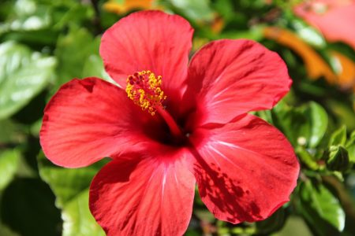{width=40%}

# Metodología
El estudio se realizó en la Isla de Barro Colorado (IBC), localizada  entre los 9$^{\circ}$ 09’ N y 79$^{\circ}$ 51’ W, que forma parte del Monumento Natural de  Barro  Colorado  (5,500  ha,  Leigh,  1999).  Es  una  isla formada en 1914, cuando se represó el Río Gatún como parte del  trabajo  para  la  creación  del  Canal  de  Panamá {moreno2012ambito}. Es una Zona administrada por el Instituto de Investigaciones Tropicales del Smithsonian dedicada a investigaciones cientificas.

Dentro de Isla se encuentra la parcela de 50 Hectáreas que tiene 1,000 metros de largo y 500 metros de ancho lo que da un total de 50 ha que se subdivide en 1 ha. En esta se llevó a cabo nuestro estudio.(ver mapa 1)
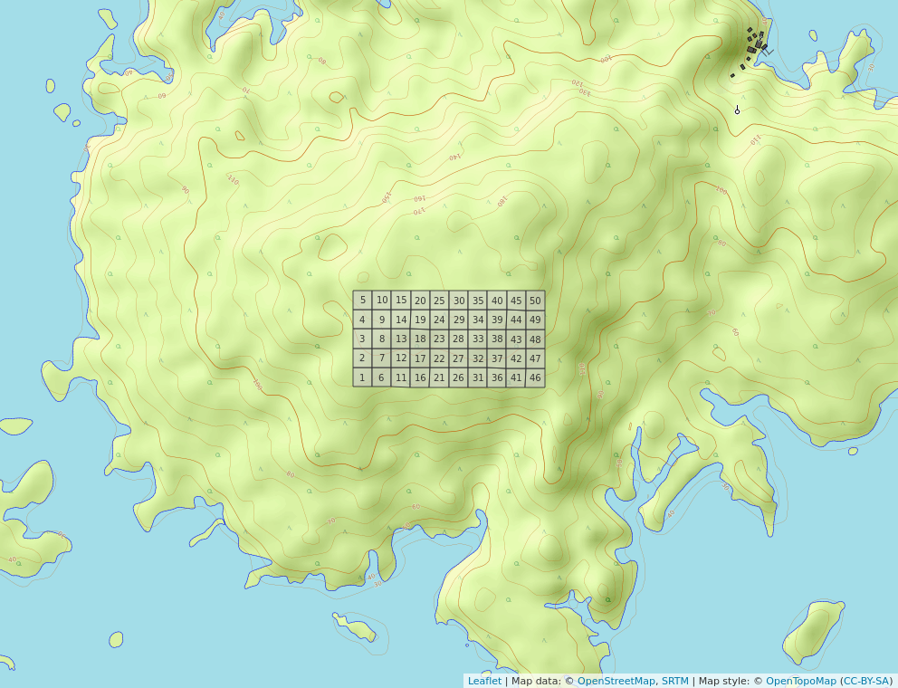{width=60%}

En esta primera parte del trabajo se hace un análisis ambiental de asociación estadística con los datos pre-censales de la parcela de BCI. Usando una matriz de comunidad convertidas en columnas de hábitats para generar mapas de abundancia por especie, abundancia de la comunidad, abundancia de riqueza numérica de toda la comunidad, mapa de simbología de nitrógeno y simbología del ph. 

Se usó la transformación de la matriz de Hellinger, para medir la asociación de distancia entre sitios; utilizandose la similaridad o la disimilaridad de Jaccard obteniendose una matriz de distancia de comunidad transformada a la cuál se le calculó su distancia Euclidea. Esta distancia Jaccard indica que mientra mayor distancia menor similaridad, es decir, mientras más crece la distancia el parecido entre los sitios es cada vez menor.

De este mismo modo para análisis de asociación se usaron las métricas de modo Q y R; como el coeficiente de correlación de Pearson que mide la relación estadistica entre dos variables.

La segunda parte del trabajo se basó en el analisis de agrupamiento. Con el fin de comprobar el método más adecuado se utilizaron los criterio de enlace simple (se usa distancia mínima), completo (se usa distancia máxima) y promedio (media entre valores de distancia mínima y máxima, mejor conocido como UPGM), esto basandos en la matriz de comunidad transformada a "normalizada". Las técnicas elegidas en base a agrupamiento de manera secuencial, jerarquico por aglomeración, monotético, aplicando técnicas probabilistacas y no restrigidas. De esto modo con los valores de abundancia de especie junto con el método de varianza mínima deagrupamiento de Ward se va construyendo un árbol dentrítico.

Para efectuar el método más conveniente se usó el criterio de correlación cofenética, que consiste en la aproximación entre la distancia cofenética y la matriz de distancias Euclideas a partir de la matriz de cuerdas. Otro criterio a tomar en cuenta fue la técnica de anchura de silueta (por el método WARD y UPGMA),que refleja los cortes del arbol en varios grupos usando la posición que ocupa el promedio más alto. En este caso el valor de anchura promedio fue 2 con 3 sitios. En un principio se descartaron los grupos con menos de 3 sitios, sin embargo el valor máximo más proximo tenian mucha diferencia con el valor de la posición 2, por lo que se puede decir que la posición 2 es la más optima.

Para evaluar homogeneidad de promedios usaron las pruebas TStudent (medias), y la prueba no paramétrica de la suma de rangos de Wilcoxon (medianas), usando como variable de agrupamiento los grupos establecidos en el agrupamiento UPGMA y Ward.Estas sirvieron para hacer una correlación con los resultados de abundancia global y riqueza. 

Con el análisis de especies indicadoras mediante Indval se obtuvieron las especies consideradas como indicadoras y un análisis de especies con preferencia por hábitat mediante el coeficiente de correlación biserial puntual. Con la técnica de boostrap multiescalar (BP) se calcularon los intervalos de confianza también conocidos como valores de probabilidad insesgada (AU). Dicha técnica consiste en un método de remuestreo de datos que permite resolver problemas relacionados con la estimación de intervalos de confianza o la prueba de significación estadística {ledesma2008introduccion} de este modo se usó la prueba de permutación que se usa para obtener una mayor precisión de resultados.
 
Con la prueba de ANOVA y Kruskal-Wallis se evaluaron la homogeneidad de medias y medianas representadas por paneles de diagrama de cajas.

Dentro del análsis de agrupamiento, se realizó la ordenación simple (no restringida) usando la técnica PCA y la ordenación canónica (restringida). En el primer caso, las tendencias detectadas en el conjunto de datos de interés, no están restringidas por otro conjunto. En el segundo caso, las tendencias detectadas en un conjunto de datos se asocian a otro conjunto. En la técnica PCA  por sus siglas eningles "principal components analysis" se usó la variable de suelo a través para generar del gráfico de escalonamiento. 

En los Análisis de diversidad alpha y beta  (di) se determinaron dos componentes principales que fueron la riqueza y equidad. En el análsis Alpha el indice de la entropia de Shannon se usó para medición el indice de equidad de Pielu

Otro indice es el de concentración de Simpson es un indice que mide la concentración. El método de la ralefacciones se usa para poder estimar combinaciones. Estima una riqueza para las muestras que se dividen en dos metodos asintóticos y no  asintóticos.
La entropia de Renyi generaliza estos 3 indices anteriores y se obtienen los números de diversidad de Hill.

En el análisis beta se busca la equidad usando la aproximación de Whittaker, asociada a los números de Hill y la ratio. Y la otra parte identificar las especie y sitios que contribuyen a la diversidad beta.

Ecología numérica

Se realizaron análisis de vencidad, un análisis de autocorrelación espacial mediante correlograma de puntos, análisis de correlación a apartir de multiples variables como abundancia de especies y variables ambientales usando el resumen estadistico y de correlograma aplicandolo a la matriz de comunidad. De este modo se aplicaron técnicas del programa mantel para determinar la correlación entre dos matrices de distancia y determinar autocorrelación mediante la prueba de permutación para I de moran,utilizando los denominados lisa ba. 

EL analisis de autocorrelación de una variable ambiental en este caso ph, A traves del metodo I Moran se analizaron la correlación de la variable PH no se ve autoccorrelación espacial de acuerdo a los resultados de estimación y expectativa, en el orden 9 la autocorralzión es positiva y este implica 10 sitios.

# Resultados
Análisis ambiental

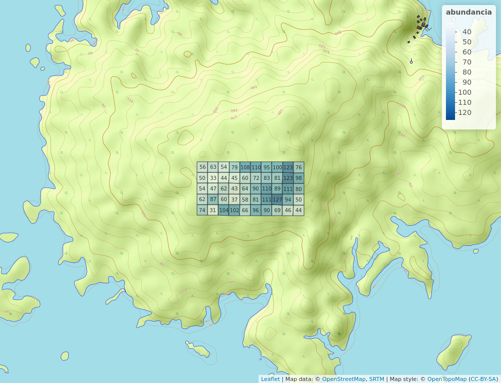{width=50%}

La mayor abundancia de la familia Malvaceae se concentra en el cluster de la parte oriental, mientras que en la parte occidental los cluster son de baja abundancia.La abundancia global se concentra en la parte occidental, por lo tanto mi familia no sigue el patron que siguen todas las plantas de familia de BIC.

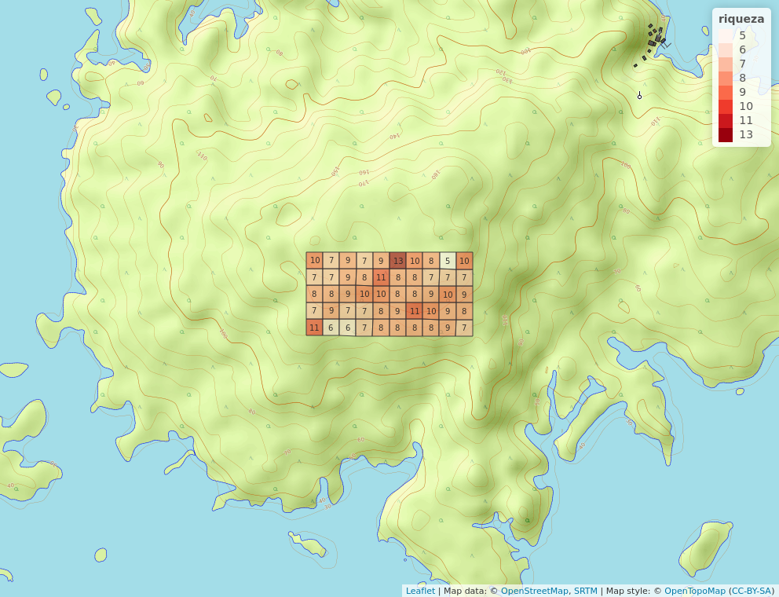{width=50%}

Las riquesas máximas en la familia de plantas Malvaceae se encuentran en el borde superior central, a diferencia de los patrones de riqueza global que se encuentran en el centro y al borde noriental. 

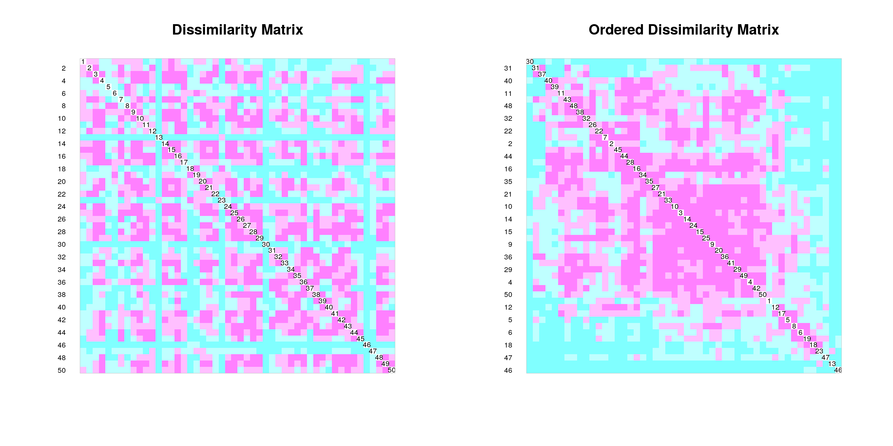{width=50%}

En este mapa de calor se muestran dos matrices de distancia, la primera  ordenada en función del orden que van apareciendo los sitios y la otra  ordenada en función de la fuerza de asosiación Euclidea de la matriz transformada Hellinger. Los clústers muestran una fuerte asociación entre los sitios 22 al 50 en el centro, lo que indica estos lugares tienen una cierta asociación en cuanto a sus espepcies compartidas y desde el punto de vista de la distancia Jaccard están muy próximos.

recordando el color rosado indica distancia corta y mientras más cortas los cluster se parecen entre sí. 

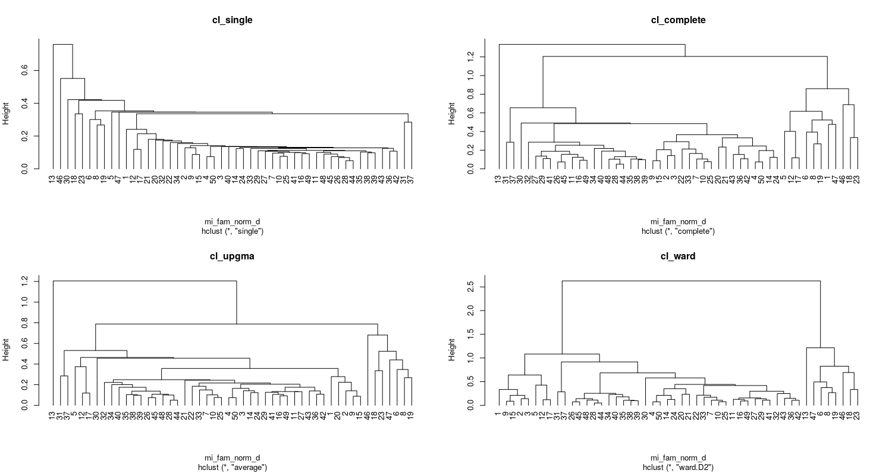{width=50%}

Este es el dendograma generado con los métodos de enlaces simple, completos, UGMA y Ward. Se muestran una distancia diferente entre los nodos de altura. Los cortes fueron muy desiguales en el método UPGMA, completo y simple donde se abarcó 2 grupos; en el primer grupo tenía 7 sitios de árboles, otro grupo solo un sitio (el sitio 13), y el 3er grupo poseía los 42 restantes.(ver figura 2)

Tomando el criterio de la correlación cofenética y el método de anchura de silueta,se hizo un contraste entre el método UPGMA y WARD. Con el método UPGMA el promedio de anchura de silueta sugería usar 2 grupos un grupo grande y otro pequeño, sin embargo aparece un tercero en el mapa de calor.

El grupo grande ocupa la mancha rosa central que se extiende hasta el borde inferior derecho, y el grupo pequeño ocupa la posición superior derecha. (ver figura 3) Aunque los promedios de anchura de siluetas sugerían usar 2 grupos, el mapa de calor parece sugerir que existe un tercer grupo entre los dos anteriores, representado por los sitios 18, 

Evaluación mediante remuestreo por *bootstrap* multiescalar

 No obstante, aun con todas sus bondades, los datos censales carecen de una fortaleza: no reflejan asociación con grandes unidades de hábitats y, a lo sumo, revelan asociación con microhábitats muy específicos, por lo que extraer conclusiones sobre patrones de asociación con variables ambientales de manera más general, presenta sus limitaciones.

un método que consiste en tomar muestras aleatorias de los datos y realizar, con cada una, análisis de agrupamiento. Este proceso se repite varias veces (e.g. 1000 veces), es decir, se realizan varias iteraciones. Al finalizar, se cuenta la proporción de veces que un grupo dado aparece consistentemente como clúster (tasa de éxito), la cual se denomina probabilidad de *bootstrap* del clúster en cuestión (*bootstrap probability*, BP). A este procedimiento se le ha añadido más recientemente el criterio de remuestreo por *bootstrap* multiescalar, es decir, considerar muestras de tamaños diferentes, a lo que se denomina valores de probabilidad aproximadamente insesgados (*approximately unbiased*, AU). Los valores de AU son, en principio, más fiables que los de BP, por lo que serán los preferidos en este análisis.

Rectángulos de borde azul, para todos aquellos grupos que resulten con valores de AU>0.91 en sus nodos. Estos rectángulos permitirán ver los grandes grupos sin perder robustez, dado que prefiero el enfoque de agrupador (*lumper*) por encima del desglosador (*splitter*); con esto además evito la tendencia de dividir en demasiados grupos pequeños, la cual vengo evitando desde análisis anteriores por el alto grado de autocorrelación espacial que afecta a los datos de BCI.

 
 En este  caso, el valor de anchura promedio de la posición 2 se diferencia, por mucho, del de la posición 3. Por lo tanto, puedo elegir con seguridad 2 como número de clústers óptimo.

se dedujo que el metodo mas apropiedo era Ward por ser el mas facil de entender.
Con el método Ward fué más facil de entender, ya que los cortes

A todo esto se dedujo que fué el método más a apropiado.

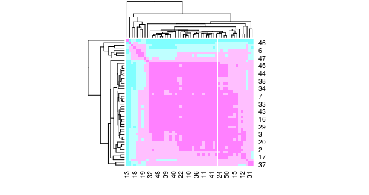{width=50%}

El siguiente mapa corresponde a un mapa de calor entre el dendorama, mientras más rosado hace referencia a una aproximación entre sitios y el azul representa a la lejania que existen entre los sitios.

En el primer grupo de cluster se identifica que los sitios localizados a su izquierda están muy cercanos pero los que le quedan a su derecha muy distantes.
n este mapa de calor lo que se refleja son las distancia reflejas de un sitio a otro en cuanto a su composición.

Se relfleja que los primeros clustes represntados por 7 grupos se ven mas separado del resto. Los 42 sitios restantes forma un cluster enorme juntos entre sí
El sitio 17 quedó como una hoja aislada.

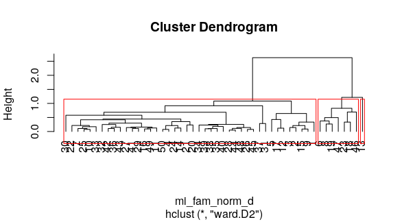{width=50%}

Figura 2

Se generaron mapas de todas las variables ambientales por medio de paneles 

Cuando se crea la matrix y se crea un panel de correlación mostrando datos de dos colores, el coeficiente de correlación cuando esta en azul no es estadisticamente significativa, cuando está en rojo si es significativa.

se puede encontrar que la organización de las especies por grupos está influenciada por estas variables cuando las pruebas no son significativas presentan una mediana mas o menos a la misma altura.

El porcentaje de interfluvios podria estar asociandose por la composición de especie, es decir,que de acuerdo a la posición geomorfológica puede encontrarse una determinada especie.

Especies indicadoras (hacer cuadro)

La homogeneidad de promedios se evaluaron mediante las pruebas T de Student y la suma de rango de Wilcoxon por el métodos de ward divididas en dos grupos.Las variables B, Mn, N, Ph,P resultaron ser significativamente diferentes y en el relieve de porcentaje es la pendiente media (ver figura 3).

De esta forma los valores mas elevados del grupo 1 que son las variables Mn y N marcan una acidez mayor.
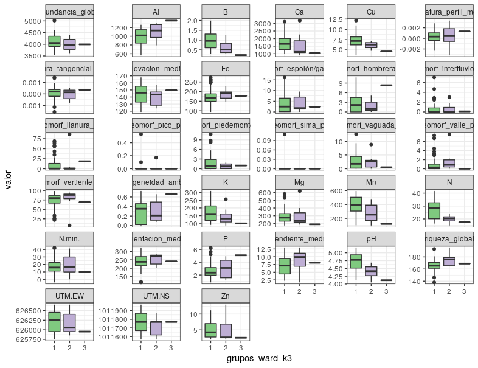{width=70%}

Las especies indicadoras se obtuvieron mediante el método Indval, se encontraron en total 3 especies que pueden ser consideradas como indicadoras. en el grupo 1 se encuentró una 1 especie indicadora, esto quiere decir que es una especie extremadamente signicativa en la prueba de permutación.

aa3

Técnicas de ordenación

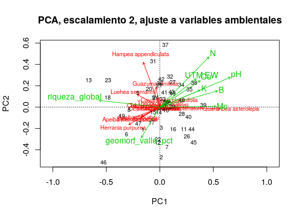{width=50%}

Aqui se presentan las variables que resultaron asociadas de acuerdo con la prueba de permutación, ante un nivel de significacia de 0.05,esto significa que muchos de los datos asociados de suelo se relacionan con la matriz de comunidad lo que lo convierte en análisis consistentes. De acuerdo a la definición se trata de una ordenación no restrigida con ajuste pasivo. Hay mas autocorrelación hacia el Oeste.Las especies estan mostradas en color rojo y los elementos en colores verdes.

t02
Las varaianza tanto restringida con no restrigida muestra un valor de 0.48 y 0.52 l que quiere decir que el suelo es importante.

El valor de varianza insesgado dió como resultado un 0.29,esto explica es que solo se explica un 29 % de los componentes del suelo, resulta ser un valor muy bajo.El grado de preferencia de cada especie la abundancia de especies por cada sitio está variando y eso es por las variables del suelo por lo menos en un 29 %

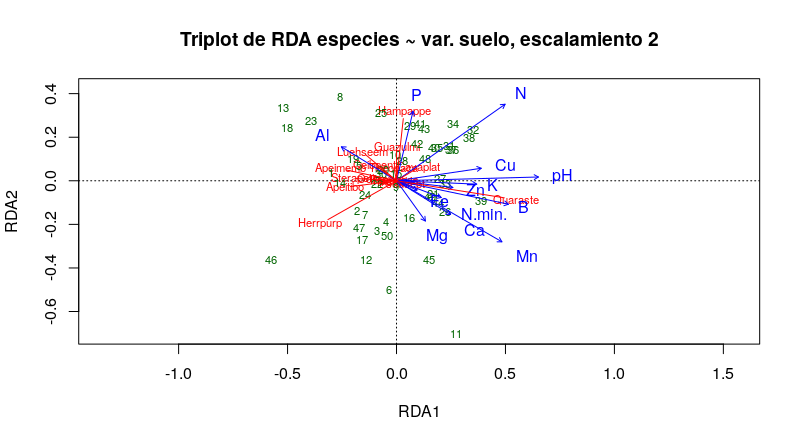{width=50%}

 
El RDA anterior mostró que las variables de suelo zinc y potasio, al igual que calcio y magnanesio. Esto es  útil para predecir la matriz de comunidad. Hay mucha colinealidad entre algunas variables.

Se excluyeron algunas variables por no ser significativas como el caso de B Y Ca y dió como resultado graficos similares ningun vector se superpone,sitios asociados con las variables de suelo.

Hay una proprocion de varianza sesgada se quitaron las colineales, la varizanza sesgada es menor que la de matriz ambiental de suelo.En el triplot las distancias auclidias y entre los siito hacen sentido Se nota que hay un cluster de sitios en asociada con heterogeneidad ambiental.La que contribuyen más es
la especie que tenga la puntacione mas corta en este caso viene siendo Guazulmi

El analisis de correspondencia canónica se basa en el ajuste de distancia ji cuadrado hacia variables ambientales,
El particionado de la distncia ji cuadrado escalada indica caunto estoy consiguiendo explicar por la via de la ordenación restrigida 
Las especies raras o excluidas son Apeitibo" "Cavaplat" "Ceibpent"
 Al hacer los datos por el metodo de distancia de ji cuadrado es muy dificil hacer los analsis
La proporción de ji cuadrado no aumenta se mantuvo igual. En ji cuadrado escalado insesgado tiene una disminución no tan significante.
Al ser sisitos tan autocorrelacionados no es tan facil hacer un análisis por los sitios esta agolpados entre sí

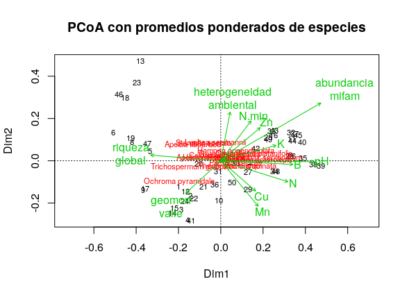{width=50%}

Análisis alpha y beta

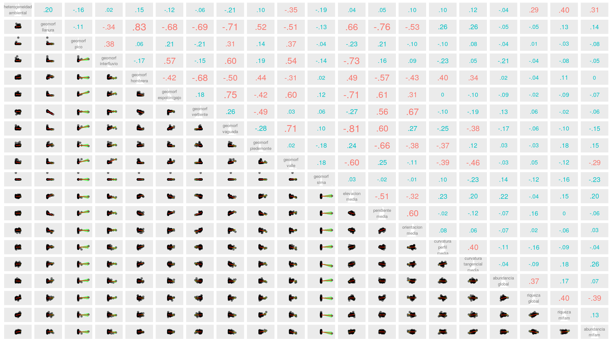{width=50%}
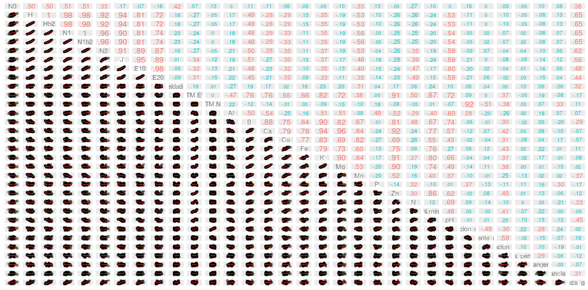{width=50%}

La diversidad alpha

En este panel pocas parte de los elementos (números de entropia y ratios de hill) han presentado una fuerte asociasion con las variables geomorfológicas. Sin embargo los mismo muestran una fuerte asociación con las variables ambientales tales como el boro,calcio,manganesio, y una correlación altisima con el PH por esta razón es baja en Aluminio. Podemos concluir que el  Ph es la variable de suelo más representativa en esta familia de plantas. La parte roja indica la significacia y la parte azul indica lo contrario.

En la diversidad beta se determina que Hampea appendiculata y Quararibea asterolepis son las especies que más contribuyen a la diversidad beta con 0.18 y 0.14 % (ver tabla 1),mientras que los sitios con mayor contribucción son 13 con 0.12 y 46 con 0.86 % de especies.

Tabla 1. Las especies que más contribuyen a la diversidad Beta 

| Especies de planta   |valor| 
|----------------------|-----|
|Apeiba membranacea    |0.08 | 
|Apeiba tibourbou      |0.07 |          
|Hampea appendiculata  |0.14 |              
|Herrania purpurea     |0.11 |              
|Luehea seemannii      |0.09 |              
|Quararibea asterolepis|0.18 |                

Ecología numérica

Mediante la pruba de permutación para el I de Moran se probó la autocorrelación entre cada especie de plantas. De acuerdo con el resumen estadistico las especies con mayor autocorrelación fueron Apeiba membranacea, Herrania purpurea y `Quararibea asterolepis (ver figura ).

Los elementos quimicos del suelos mas represetantivos en la autocorrelación fueron el zinc con 0.85%, el potasio 0.74%, el calsio  0.69 y el pH con 0.72%.
En cuanto a las zonas geomorfológicas se encuentra una alta correlación en la llanura, en el espolón, en la vertiente y en la vaguada (ver figura).

Con la prueba Mantel se corroboró la autocorrelación entre las matrices de distancias sin tendencias (residuos) es decir, la parte no explicada por las coordenadas.

la proporción de las abundancias transformadas no explicada por la posición. 

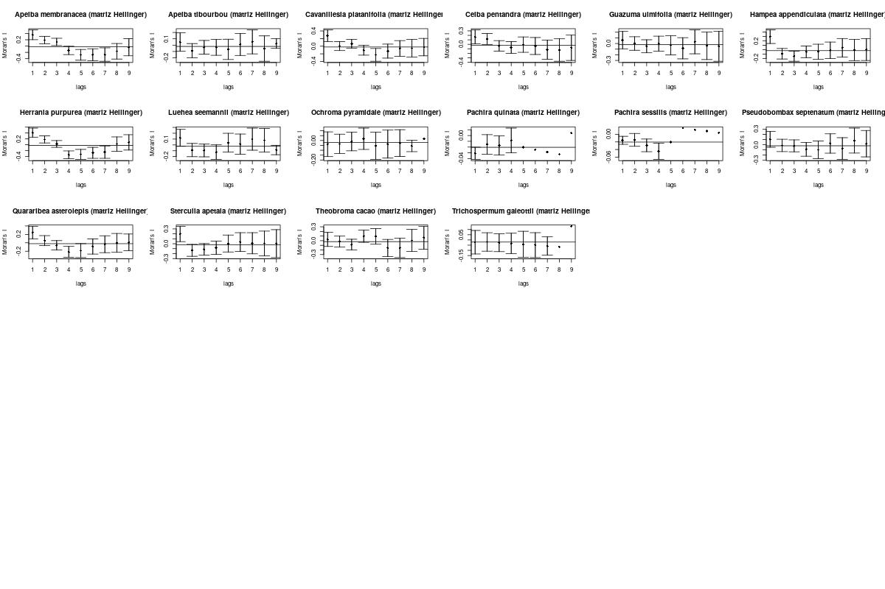{width=50%}

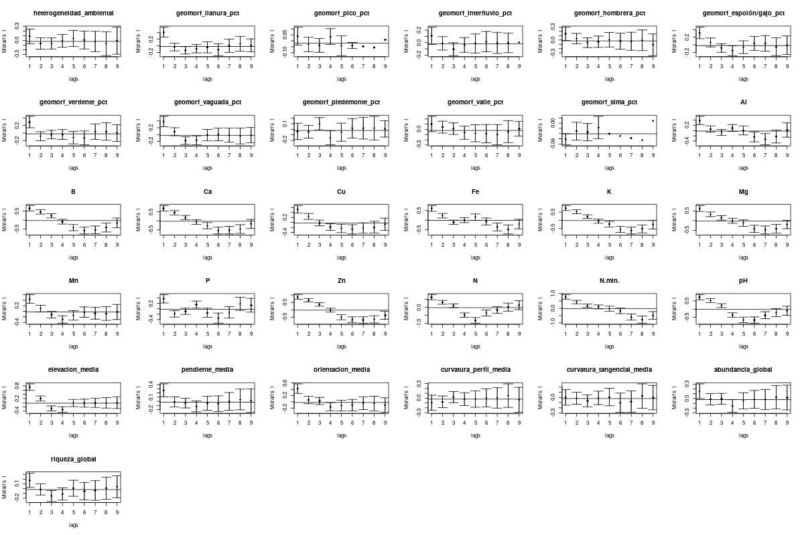{width=50%}

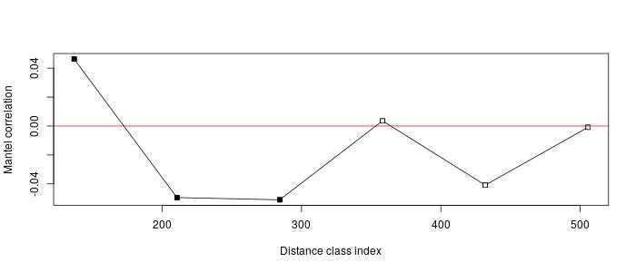{width=50%}

El correlograma muestra que para el nivel de significancia 0.01 hay autocorrelacion asi como para los 200 metros y para los otros ordenes hay una autocorrelación espacial de este modo se observó una dependeica espacial autocorrelación  inducida

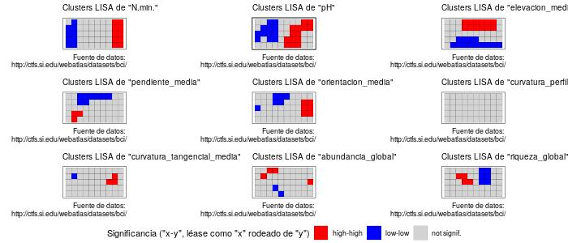{width=50%}

Los cuadros rojos es la autocorrelación espacial con valores altos y el azul reprsenta una autocorrelación espacial con valores bajos
Estos clúster LISA muestran que el PH es la variable que mas esta autocorrelacionada lo que quiere decir que ese lugar es muy acido y es significativamente alto.
La variable de elevación media esta al norte donde BCI es mas elevada

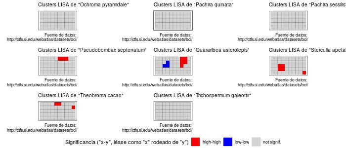{width=50%}

En este caso Quararibea asterolepis tiene valores abundancias grandes rodeadas de abundancias grandes. Otras especies como Sterculia apetala, Theobroma cacao y Pseudobombax septenatum muestraun un patrón similar aunque en menor medida.

# Discusión

El estudio presentó las diversas formas método de análisis de datos que descomponga la varianza total de un sitio por especie.

# Agradecimientos

# Información de soporte

\ldots

# *Script* reproducible
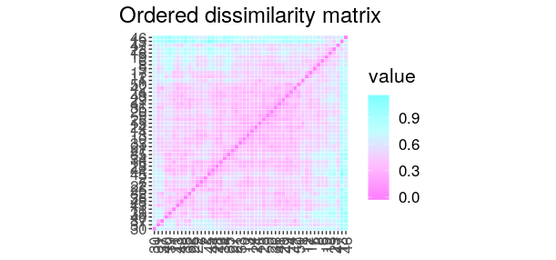{width=50%}
{width=50%}

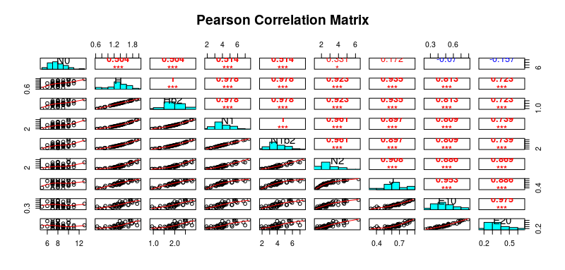{width=50%}

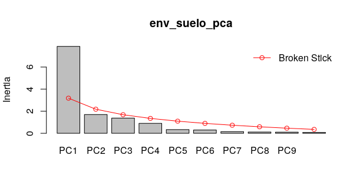{width=50%}

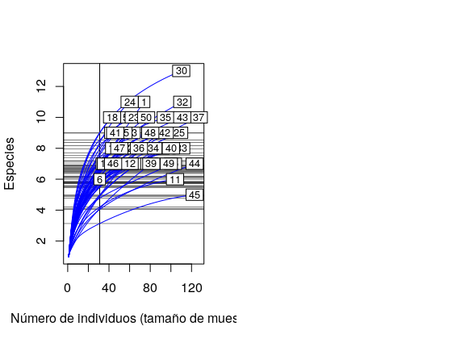{width=50%}

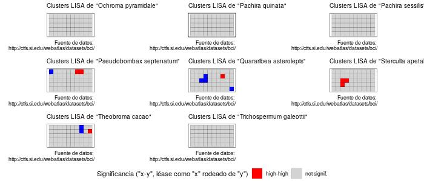{width=50%}
