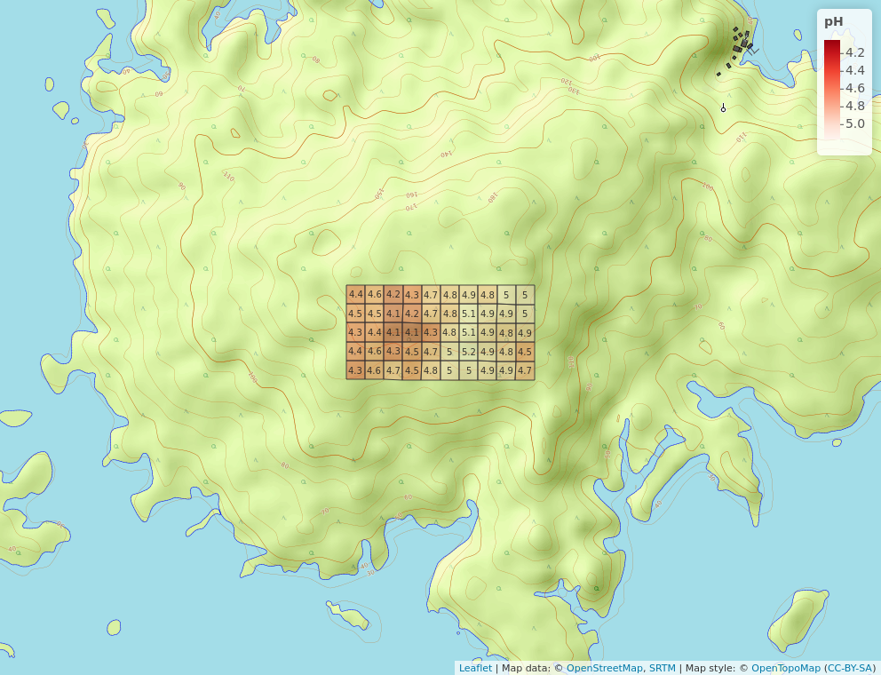
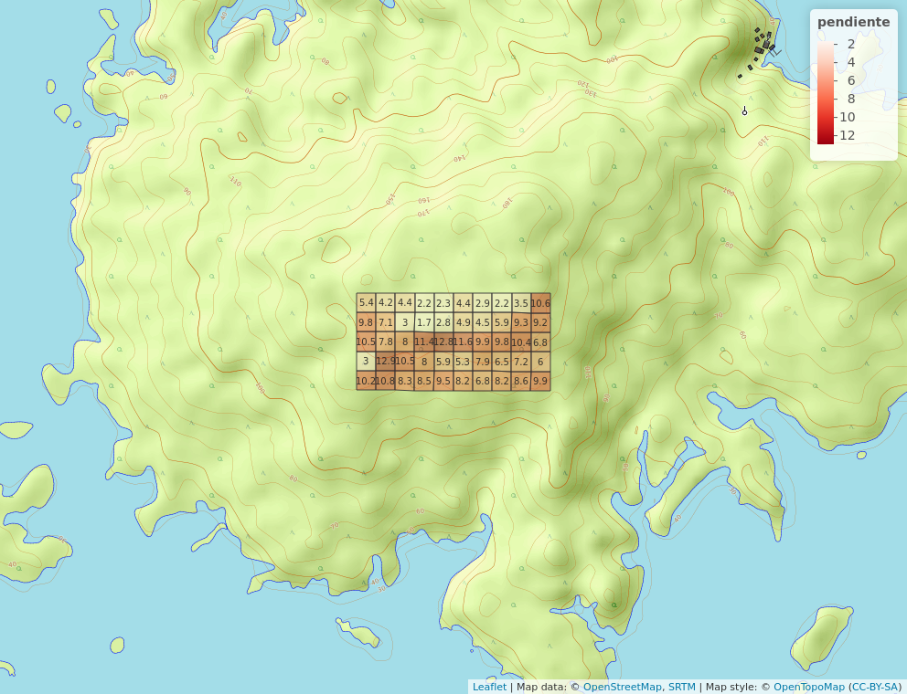

# Introducción
La Ecología es una disciplica científica dentro de las ciencias biológicas y físicas basada en el estudio de la relación entre los organismos y su medio ambiente.Esta relación incluye interacciones con el mundo físico, así como también con miembros de la misma y de otras especies.[@smith2007ecologia] 

[@bishop1995drainage;@sun2007fast]

{width=50%}

| 12 | 34 | 56           | 77 | 23 |
|----|----|--------------|----|----|
| 67 | 85 | 234          | 86 | 89 |
| 93 | 45 | texto prueba |    |    |
|    |    |              |    |    |

{width=50%}

{width=50%}

# Metodología

\ldots

# Resultados

\ldots

# Discusión

# Agradecimientos

# Información de soporte

\ldots

# *Script* reproducible

\ldots

# Referencias

