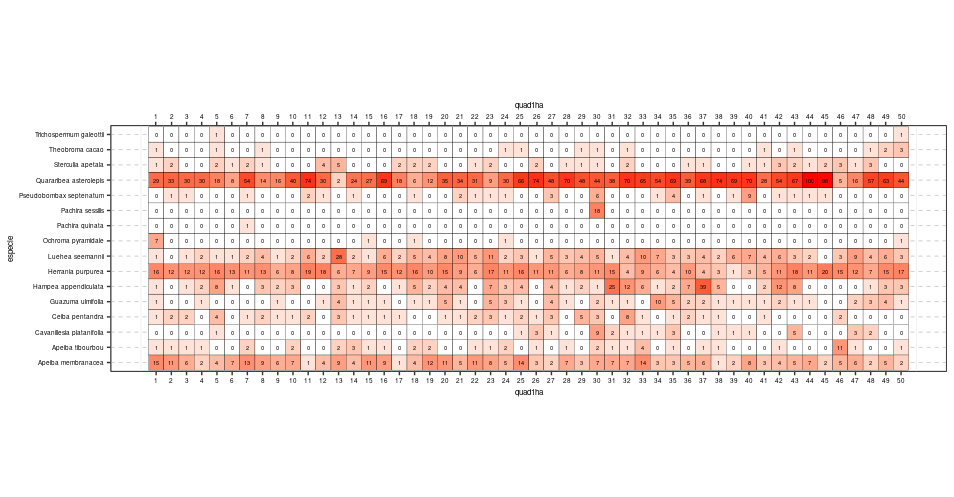
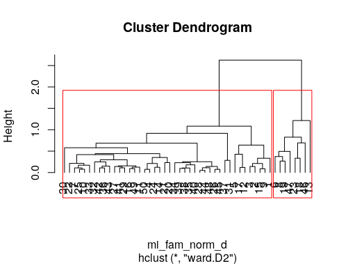
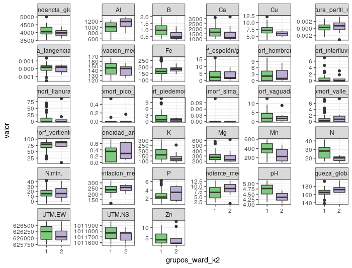
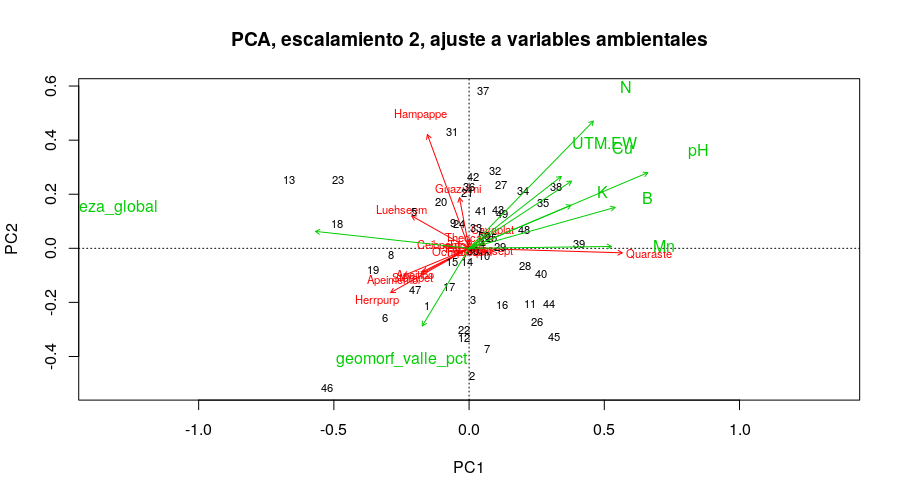
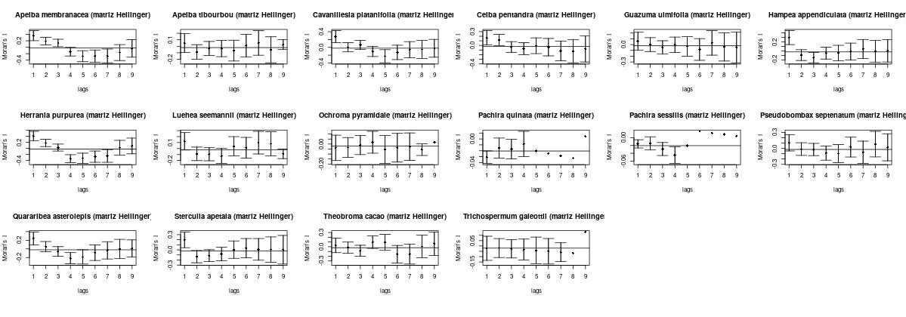
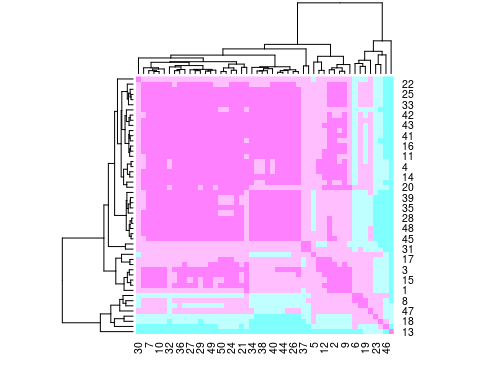

# Introducción
Una de las áreas naturales más estudiadas por los cientificos durante años ha sido la isla Barro Colorado (BCI) localizada en el lago Gatún del canal de Panamá. Su diversidad de bosques y su fauna la han convertido en un centro de estudio, útil para hacer proyectos de exploración. Es considerada como uno de los sitios con más larga historia de investigación continua en los trópicos del Nuevo Mundo, lo que ha proporcionado una base de información científica inigualada en todo el planeta. Cada año, entre 200 y 400 científicos de todo el mundo visitan el Monumento Natural Barro Colorado.[@fisher2016]

La mitad de la isla se encuentra cubierta de bosque jóven tropical húmedo semi-perenne de 100 o más años de edad, el resto está cubierto de bosque viejo el cual ha sufrido muy pocas perturbaciones en los últimos 400 años  [@moreno2012ambito]. Se caracteriza por tener un promedio anual de temperatura de 27$^{\circ}$ C en áreas abiertas, con una variación diurna de 9$^{\circ}$ C. Tiene una precipitación promedio anual es de 2,600 mm, con una estación lluviosa que va de mayo a diciembre, y una estación seca que comprende los meses restantes. Está constituida por un total de 265 especies de plantas, y cada una pertenece a una familia. [@croat1978flora]. 

Dentro de su amplia variedad de familias de plantas se encuentran las *Malvaceae*. Esta planta pertenece a la familia de las *Malvales*, que reúne cerca de 250 géneros y 3929 especies distribuidas por las regiones templadas y cálidas de todo el mundo [@rondon2009]. 

Son plantas de hierbas, arbustos o árboles, generalmente con pelos estrellados. Los tallos son de fibra de líber robusta con cavidad de mucílago. Las hojas son simples, alternas,palmadamente divididas, palmadas veteadas, con estípulas y pecioladas. Las flores son actinomórficas, solitarias, fasciculadas o dispuestas en cimas o panículas con sépalos de 3 a 5, libres o connatos y valvados. Los pétalos son cinco, libres, giratorios, adnados a la columna estaminal en la base. Los estambres son numerosos, filamentos connados en tubos, conocidos como adelfos [@xu2017malvaceae](ver figura \ref{Figura}).

{width=50%}

Barro Colorado ofrece ventajas excepcionales para un estudio de ecología, y la morfología de ciertos grupos de plantas podría investigarse provechosamente [@standley1927flora]. Razón, por la que el presente estudio se basó en analizar el comportamiento de la familia de plantas *Malvaceae* en BCI; en el cual abarcó un análisis de abundancia, riqueza, asociación, distribución, agrupamiento, autocorrelación espacial entre las variables de la familia y la influencia que tienen los factores ambientales y geomorfológicos en su patrón de distribución y asociación. 

De igual forma, con el análisis de diversidad (alpha y beta) conocer la riqueza y equidad de las especies junto con los sitios que tienen mayor y menor diversidad. Además de, conocer las especies consideradas como indicadoras, y determinar la colinealidad existente entre variables del suelo especies. 

Por último, identificar cuáles son las especies, elementos del suelo y áreas morfológicas más significativos en la distribución, diversidad, autocorrelación espacial, y en su homogeneidad. Por otro lado, se busca conocer el método más eficiente para agrupar y organizar los datos a través de dendogramas. Esta investigación podrá ser utilizada como base para estudios posteriores con esta importante familia de plantas.


# Metodología


*Área de estudio y descripción de metodología*

El estudio se realizó en la Isla Barro Colorado (BCI), localizada entre los 9$^{\circ}$ 09’ N y 79$^{\circ}$ 51’ W, que forma parte del Monumento Natural de  Barro  Colorado  (5,500  ha,  Leigh,  1999). Formada en 1914 cuando se represó el Río Gatún como parte del  trabajo  para  la  creación  del  Canal  de  Panamá [@moreno2012ambito]. Es una zona administrada por el Instituto de Investigaciones Tropicales del Smithsonian dedicada a investigaciones científicas.

Dentro de Isla se encuentra la parcela de 50 Hectáreas con 1,000 metros de largo y 500 metros de ancho lo que da un total de 50 ha que se subdivide en 1 ha. En la que se llevó a cabo el presente estudio (ver figura  \ref{mapa_1}).


{width=50%}


La mayor parte del trabajo se desarrolló en entorno al lenguaje de programación R, en el cuál se efectuaron los análisis de agrupamientos, ambientales, ordenamiento y de ecología numérica, apoyandose con paquetes como *tidyverse* junto con *dplyr* y *vegan* con la cual se crearon las matrices de comunidad ambientales. Con el paquete *simple features* (sf) se crearon cuadros por hectáreas para así obtener la densidad de cada especie. En menor medida se emplearon los paquetes *adespatial*, *vegetarian*, *broom* y *cluster*. Paquetes como *ez* fueron usados para la correlación entre variables y *ggplot2*, *mapview* y *graphics* para la representación gráfica. Los datos se obtuvieron a partir del repositorio de ecología númerica de José Martinez Battle [@jose_ramon_martinez_batlle_2020_4402362](2020).

En la primera etapa del trabajo se efectuó un análisis ambiental de asociación estadística con los datos pre-censales de la parcela de BCI, usando una matriz de comunidad convertidas en columnas de hábitats para generar mapas de abundancia por especie, y riqueza numérica de toda la comunidad.

Para el análisis de asociación se usaron las métricas de modo Q y R; con el coeficiente de correlación de Pearson que mide la relación estadística entre dos variables. En cuanto a la medición de asociación de distancia entre sitios; se usó la transformación de la matriz de Hellinger con la metodología de la similaridad de Jaccard para obtener una matriz de distancia de comunidad transformada a la cuál se le calculó su distancia euclidea la cual indica que mientras mayor distancia menor similaridad, es decir, mientras más crece la distancia el parecido entre los sitios es cada vez menor.

La segunda fase del trabajo se basó en el análisis de agrupamiento. Con el fin de comprobar el método más adecuado para agrupar las especies en forma de dendograma se compararon los métodos de por enlace  simple, completo, de grupo de pares ponderados con media aritmética conocido como UPGMA (siglas de *unweighted pair group method with arithmetic mean*) y el método Ward teniendo como criterio la correlación cofenética. 

Con los valores de abundancia de especie junto con el método de varianza mínima de agrupamiento de Ward se construyó un árbol dentrítico tomando el criterio de la técnica de anchura de silueta, que refleja los cortes del arbol en varios grupos usando la posición que ocupa el promedio más alto. Para obtener resultados más fiables se usó el reemuestreo de boostrap multiescalar que permite resolver problemas relacionados con la estimación de intervalos de confianza o la prueba de significación estadística [@ledesma2008introduccion].

Por medio de la prueba *t* de *Student*, y la prueba no paramétrica de la suma de rangos de Wilcoxon (medianas), se evaluaron la homogeneidad de medias y medianas para dos grupos usando como variable de agrupamiento los grupos establecidos en el agrupamiento  Ward. Estas sirvieron para hacer una correlación con los resultados de abundancia la global y la de la especie.

Mediante el valor indicador (indVal) se detectaron las especies consideradas como indicadoras y un análisis de especies con preferencia por hábitat por medio del coeficiente de correlación biserial puntual. 

Utilizando la técnica del análisis de componentes principales (PCA) y técnica de ordenación restrigida de analisis de abundancia o RDA (siglas de *Redundancy Analysis*) y canónica por la prueba de *Chi* cuadrado. Se comprobó la coleidalidad entre las variables del suelo y tipos de especies y reconocer la especies más contribuidora, esto se realizó por el criterio de valores señalados con *VIF*.

Para la tercera etapa se midió la de diversidad (alpha y beta) donde se determinaron dos componentes principales; la riqueza y equidad. Por medio de la entropia de Shannon y la antripia de Simpson se midió el indice de equidad de Pielu para la diversidad alpha.En el análisis beta se buscó la equidad usando la aproximación de Whittaker, asociada a los números de Hill y la ratio. Se identificaron las especie y sitios que contribuyen a la diversidad beta. También, se utilizó el método de la rarefacción para poder estimar combinaciones se utilizaron las métricas de la entropia de Renyi generaliza para obtienen los números de diversidad de Hill.

En la última etapa, basada fundamentalmente en ecología espacial se llevaron a cabo análisis de autocorrelación espacial mediante correlograma de puntos y correlación. Así las técnicas aplicadas fueron la de mantel para determinar la correlación entre dos matrices de distancia y determinar autocorrelación mediante la prueba de permutación para *I* de *moran*, utilizando los denominados Lisa. 


# Resultados

La familia de plantas *Malvaceae* cuenta con una cantidad de 3,792 individuos dentro de la parcela (Ver Tabla 1). En promedio la cantidad de especies por hectárea ronda en torno a unas 8 individuos. 

A simple vista en la figura presentada más abajo la especie más abundante del conjunto es *Quararibea asterolepis* guardando una similitud con el resto de las especies (Ver figura   \ref{agrupado}).


| Especies de planta       |Cantidad 
|--------------------------|---------|
|Quararibea asterolepis    |2171     | 
|Herrania purpurea         |542      |          
|Apeiba membranacea        |308      |              
|Luehea seemannii          |215      |              
|Hampea appendiculata      |191      |              
|Guazuma ulmifolia         |74       |
|Ceiba pentandra           |62       |
|Sterculia apetala         |53       |
|Apeiba tibourbou          |50       |
|Pseudobombax septenatum   |42       |
|Cavanillesia platanifolia |36       |
|Pachira sessilis          |18       |
|Theobroma cacao           |16       |
|Ochroma pyramidale        |11       |
|Trichospermum galeottii   |2        |
|Pachira quinata           |1        |

Tabla 1.Abundancia por especies

{width=100%}


Al evaluar la primera etapa del estudio basado en el análisis ambiental se refleja que en la parte oriental de la parcela existe una mayor abundancia de la familia *Malvaceae* y una distribución de riquezas máximas concentrada en el borde superior central (Ver figura  \ref{mapa_abundancia} y  \ref{mapa_riqueza}). 


{width=80%}


{width=80%}

## Análisis de asociación


En el mapa de calor ordenado (a la derecha), presenta un clúster gigante en el centro que indica un patrón ordenado de dependencia entre las especies relacionadas. En la diagonal desde *Pseudobombax septenatum* hasta *Apeiba tibourbou* (cuadros de color rosa centrales). También se observan las especies que no parecen asociarse con otras, situadas en los extremos de la diagonal, y relacionadas con otras por medio de valores pequeños de distancia (cuadros azules), como *Theobroma cacao* y *Pachira sessilis*.El color rosado indica distancia corta y mientras más cortas los cluster se parecen entre sí (Ver figura \ref{fig:representacion_asociación_Jaccard}). 

{height=500%}

## Análisis de agrupamiento 

Los dendogramas fueron generados por los métodos de enlaces simple, completos, UGMA y Ward (Ver figura \ref{4_dendogramas}). Estos mostraron cortes desiguales en los método UPGMA, completo y simple produciendo agrupamientos integrados por un gran número de sitios o por un sitio único. Se detectaron elementos que no forman grupos, es decir, sitios que aparecen aislados del resto como fue el caso del método por enlace simple. No obstante, con el método Ward de anchura de silueta se generó un dendograma más legible. Dicho método sugirió dividir el dendograma en 2 grupos; un grupo pequeño integrado por 8 sitios y otro grupo compuesto por los 42 sitios restantes (Ver figura \ref{dendograma_ward}). 

{width=110%}


{width=80%}

Para la homogeneidad de promedios se evaluaron mediante las pruebas *T* de *Student* y la suma de rango de Wilcoxon por el métodos de Ward divididas en dos grupos. Estos paneles muestran el promedio entre las variables geomorfológicas y elementos del suelo. El nitrógeno (N), pH,cobre (Cu), y magnesio (Mg) y zinc (Zn) resultaron ser significativamente diferentes en media y mediana; en el caso del relieve el la pendiente media resultó tener el promedio más diferente, en cambio los elementos con mayor homegeneidad de medianas fueron el boro (B), manganeso (Mn), y potasio(K) y en las áreas de relieve estuvieron la elevación media, espolón, e interfluvio (ver figura \ref{homogeneidad}). 

Por medio del método del "valor indicador" (Indval), se encontraron en total 3 especies que pueden ser consideradas como indicadoras con preferencia de habitats. Especificamente estas especies fueron *Quararibea asterolepis* como especie asociada al grupo 1, *Luehea seemannii* y *Sterculia apetala* pertenecientes al grupo 2, lo significa que estas especies son extremadamente importantes en la prueba de permutación.


{width=90%}


## Técnicas de ordenación

En el analisis de correspondencia por el método PCA, al ajustarlo a la matriz de comunidad y usando la distancia *Chi* cuadrado, se encuentra que muchos de los componentes del suelo se encuentran asociados en las variables de comunidad, por lo que, presentan algún grado de asociación entre las especies.(Ver figura \ref{escalonamiento}).


{width=100%}


{height=500%}

{height=200%}
 
En el análisis de redundancia (RDA) anterior muestra la colealidad que existe entre las diferentes variables de especies y elementos del suelo. Las especies *Hampea appendiculata*, *Ceiba pentandra*, tienen una gran contribucción en diferentes sitios, que se relacionan con el Fósforo (P), un poco con el nitrógeno (N), en el caso de *Apeimenb* tiene mucha asociación con el Aluminio (Al). *Quaraste* es la que más contribuye al conjunto de sitios con más elementos. Por otro lado, Fueron excluidas algunas variables por tener el valor  *VIF* por encima de 10 como es el caso del magneso (Mg), calcio(Ca) y las coordenadas UTM. A pesar de, habían variables con un alto valor *VIF* por lo que se optó en conservarlas por razones biogeoquimicas y de asociación (Ver gráfico \ref{escalonamiento_triplot}).

De esta misma manera, en el análisis de correspondencia canónica (CCA) fueron excluidas las especies con menos de 100 individuos (especies raras) de la matriz de comunidad, se convervaron 5 en total, y se excluyeron 11 (Ver gráfico \ref{escalonamiento_CCA}). En ambos gráficos las variables aparecen en el mismo lugar salvo algunas especies que desaparecieron en el "triplot de CCA" por tener menos de 100 individuos. 


## Análisis de diversidad alpha y beta

Se usaron diferentes métricas para medir los principales componentes de la diversidad: abundacia y equidad. Se hicieron mediante la equidad de Shanon (equidad) y antropia de Simpson (abundancia), con los ratios de Hill, junto con los números de entropía de Renyi y la equidad de Pielu. En el panel de correlación las especies tuvieron una fuerte asociación en presencia Magnesio (Mg), calcio (K), zinc (Zn), y una altísima correlación con el pH sobre todo en la zona de hombrera, perfil de curvatura media con mayor equidad hacia el Este. Los rojos representan alta correlación significativa los azules baja (ver figura  \ref{correlacion_geo} y  \ref{correlacion_esp}).
 
En el modelo beta las especies *Hampea appendiculata* y *Quararibea asterolepis* fueron las más contribuyentes a la diversidad con 0.18 y 0.14 % (ver tabla 2),mientras que los sitios con mayor aportación son el 13 con 0.12 y 46 con 0.86 % de especies.

En el análisis de rarefacción establece los sitio de mayor y menor diversidad. En los modelos de abundancia de alpha, el sitio con mayor riqueza es el 30 con 13 especies y el de menor riqueza es el 45 con 5 especies, la abundancia máxima y mínima fueron en los sitios 6 con 127 y 37 con 31, la abundancia en el sitio más pobre fue 123 en el sitio 45, y la abundancia en el sitio más rico fue 110 en el sitio 30.

 
{height=300%}

{height=300%}


![Contribución de las especies en la diversidad Beta  \label{tabla_2}]

| Especies de planta   |valor| 
|----------------------|-----|
|Apeiba membranacea    |0.08 | 
|Apeiba tibourbou      |0.07 |          
|Hampea appendiculata  |0.14 |              
|Herrania purpurea     |0.11 |              
|Luehea seemannii      |0.09 |              
|Quararibea asterolepis|0.18 |                


## Ecología espacial


Mediante la pruba de permutación para del *I de Moran* se probó la autocorrelación entre cada especie de plantas. De acuerdo con el resumen estadistico las especies con mayor autocorrelación fueron *Apeiba membranacea*, *Herrania purpurea* y *Quararibea asterolepis* (ver figura \ref{matriz_esp}). Asimismo, los elementos quimicos del suelos más represetantivos en la autocorrelación fueron el zinc(Zn) con 0.85%, el potasio(K) 0.74%, el calcio (Ca)  0.69 y el pH con 0.72%. En cuanto a las zonas geomorfológicas se encuentra una alta correlación en la llanura, en el espolón, en la vertiente y en la vaguada (ver figura \ref{matriz_geo}).

{height=700%}


{height=800%}


{width=90%}

El correlograma presenta que para el nivel de significancia 0.04 en los 200 metros existe autocorrelación espacial en la matriz de comunidad. Esto significa que la posición 1 y 2 son las que se encuentran más autocorrelacionadas mientras que los otros órdenes (parte de los residuos) no existe una relación entre especies (Ver figura \ref{mantel}).

Los clúster LISA mostraron que el pH es el elemento químico con más autocorrelación espacial, especificamente en la zona de elevación media de BCI localizada al norte (Ver figura  \ref{LISA_ambientales}). En ese mismo orden, indicó que *Quararibea asterolepis* tiene valores de grandes de abundancias y autocorrelación seguido de  *Sterculia apetala*, *Theobroma cacao* y *Pseudobombax septenatum* que presentan un patrón similar (Ver figura \ref{LISA_especies}).Los cuadros rojos representan la autocorrelación espacial con valores altos y el azul con valores bajos.

{width=90%}


{width=90%}


# Discusión

Los resultaron mostraron que familia de plantas *Malvaceae* posee una abundancia de 3,792 especies agrupadas mayormente en la parte oriental de manera dispersa en la parcela, con riquezas máximas situadas en el borde superior central. Esta distribución de especies en grupos aleatorios depende de diferentes factores abióticos (no vivo) y bióticos (vivos).

Se determinó que en la mayoria de las especies hay una gran asociación entre ellas, y desde el punto de vista de la distancia de Jaccard están muy proximas. Adicionamente, el agrupamiento de especies en forma de dendograma se generó mediante el método Ward por ser el más facil de interpretar.

Al analizar por separado los gráficos de escalonamiento de ordenación RDA y CCA, los resultados indicaron que solo algunos compuestos del suelo están asociados con especies de la familia, como son el magnesio (Mg), calcio (Ca) siendo el pH el más representativo del área estudiada.

Se destaca la especie *Quararibea asterolepis* por encima de las otras de la familia tanto en la diversidad, distribución como en contribución de los sitios. De igual manera fue la especie con mayor autocorrelación espacial, seguida de *Apeiba membranacea* y *Herrania purpurea* las cuales también contribuyeron a la diversidad de sitios. Las zonas donde se produjo esta autocorrelación fueron en la llanura, espolón y vertiente en presencia de pH, zinc (Zn), boro (B) y calcio (Ca). En cambio, las zonas de hombrera y elevación media presentaron mayor diversidad en presencia de magnesio (Mg), calcio (Ca), zinc (Zn) que son conocidas por ser zonas húmedas.


La topografía puede verse modificada por los compuestos del suelo en la vegetación. La cantidad de agua disponible en el suelo, el pH, la cantidad de nutrientes y la textura del suelo son factores que modifican la pendiente (relieve) y por lo tanto, influyen en la distribución de las plantas en los bosques.[@clark2002factores] En BCI en áreas de tierra firme, el nivel freático puede subir ocasionalmente, y causar periodos excepcionalmente adversos y hasta letales para la vegetación [@clark2002factores]. Por tanto, las condiciones climáticas, factores edáficos y la topografía del terreno influyen directamente en la distribución y modificación de las plantas en BCI. En el caso de los compuestos donde hay escasa correlación puede deberse a un exceso de precipitación o largos periodos de sequía.

Asimismo, la alta presencia de pH en el suelo genera una acidificación que provoca una disminución en la disponibilidad de ciertos elementos nutritivos como son el fósforo, magnesio y calcio en aquellos suelos donde suelen ser absorbidos por las plantas, por lo tanto una letalidad más rápida en las plantas.[@alvaro2019].

A partir de los datos estudiados y comparándolos con estudios anteriores se distingue que las plantas son propensas a desarrollarse en áreas húmedas y con disponibilidad de agua esto se comprueba por patrones discontinuo por aglomeración en presencia en las zonas de vaguada, la llanura, el espolón y la vertiente.

Según investigadores, los patrones de lluvia están cambiando, con períodos secos extremos más frecuentes en toda la región. En el pasado, estos períodos secos puedieron haber conducido a un aumento de las tasas de extinción de fauna y flora y alteración el los compuesto del suelo [@armuelles2021]. En este aspecto, si los patrones de lluvias continúan cambiando con periodos más secos, en dos décadas la Isla Barro Colorado  podría perder especies de plantas como de animales, y esto podrían ocasionar un aumento de la tasa de extinción de las clases de plantas de la familia *Malvaceae*.


# Agradecimientos
Agradezco al profesor de Biogeografía José Ramón Martinez Battle del área de las ciencias geográficas de la Universidad Autónoma de Santo Domingo (UASD) por tener la iniciativa, propiciar las investigaciones y facilitar las herramientas para este estudio.De igual forma a la escuela de geografía de la UASD por ser fuente de formación de profesionales en el área de geografía. 

De igual forma, al Instituto Smithsonian de Instigaciones Tropicales por facilitar los datos recogidos de años en la Isla Barro Colorado. Por último a la estudiante de Ciencias Geográficas Ana Valera por ayudarme a la redacción de esta investigación.


# Información de soporte

{width=70%}

{width=60%}


{width=70%}


{width=80%}


{width=70%}


\ldots

# *Script* reproducible

## Análisis exploratorio de datos.Riqueza y abundancia

````
`r paste (readLines('aed_1:análisis_exploratorio_de_datos.R'), collapse = '\n')`

````
## Análisis exploratorio de datos. Mapas de riqueza y abundancia global de Malvaceae

````
`r paste (readLines('aed_3:mapas_riqueza_y_abundancia.R'), collapse = '\n')`

````


## Análisis exploratorio de datos. Mapas de variables ambientales

````
`r paste (readLines('aed_4:mapas_variables_ambientales.R'), collapse = '\n')`

````

## Análisis exploratorio de datos. Correlaciones entre variables ambientales

````
`r paste (readLines('aed_5:análisis_correlación_variables_ambientales.R'), collapse = '\n')`
````

## Análisis exploratorio de datos. Mapas de variables ambientales por lotes

````
`r paste (readLines('aed_6:Mapas_KML_paneles.R'), collapse = '\n')`
````

## Medición de asociación. Introducción a los modos de análisis Q y R. Modo Q aplicado a la paradoja de Orlóci
````
`r paste (readLines('ma_1:Medición de asociación.R'), collapse = '\n')`
````

## Edición de asociación. Modo Q aplicado a mi familia asignada
````
`r paste (readLines('ma_2:Modo_Q_aplicado.R'), collapse = '\n')`

````
## Edición de asociación. Modo R aplicado a mi familia asignada

````
r paste (readLines('ma_3:Medicion_de_asociación.R'), collapse = '\n')

````


## Análisis de agrupamiento (cluster analysis). Parte 2: Interpretación y comparación de resultados
````
`r paste (readLines('aa_2:analisis_de:_agrupamiento.R'), collapse = '\n')`
````

## Análisis de agrupamiento (cluster analysis). Parte 3: Grupos (clústers), variables ambientales y mapas
````
`r paste (readLines('aa_3:análisis_agrupamientos.R'), collapse = '\n')`
````

## Análisis de agrupamiento (cluster analysis). Parte 4: Especies indicadoras, especies con preferencia por hábitats
````
`r paste (readLines('aa_4:analisis_de_agrupación.R'), collapse = '\n')`
````

## Técnicas de ordenación. <br> Parte 1: Ordenación no restringida. PCA, CA y PCoA
````
`r paste (readLines('to_1:Técnicas_ordenación_1.R'), collapse = '\n')`
````

## Técnicas de ordenación. <br> Parte 2: Ordenación restringida o 'canónica'. RDA, CCA
````
`r paste (readLines('to_2:técnicas_de_ordenación.R'), collapse = '\n')`
````

## Análisis de diversidad. Parte 1: Diversidad alpha

````
`r paste (readLines('di_1:Análisis_de_diversidad_Alpha.R'), collapse = '\n')`
````

## Análisis de diversidad. Parte 2: Diversidad Beta

````
`r paste (readLines('di_2:diversidad_beta.R'), collapse = '\n')`
````

## Análisis espacial de datos ecológicos. Autocorrelación

````
`r paste (readLines('ee:ecología_espacial.R'), collapse = '\n')`
````

