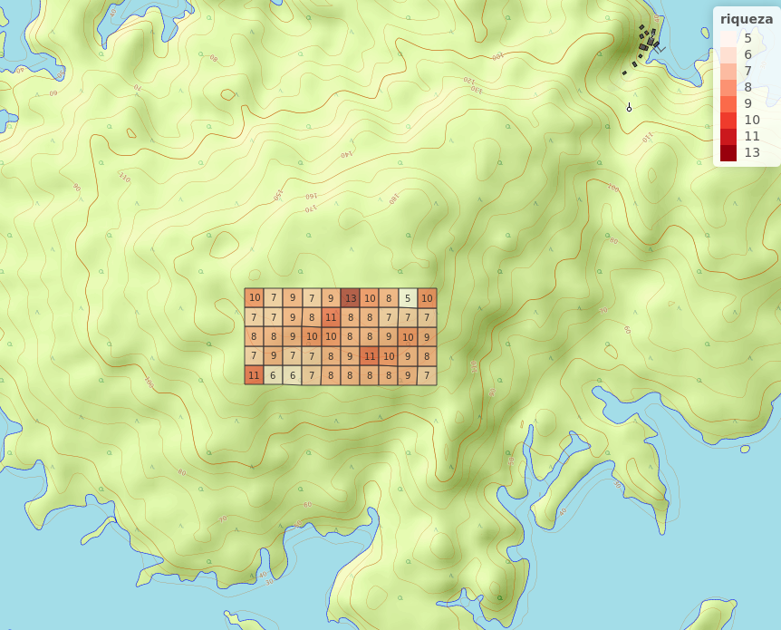
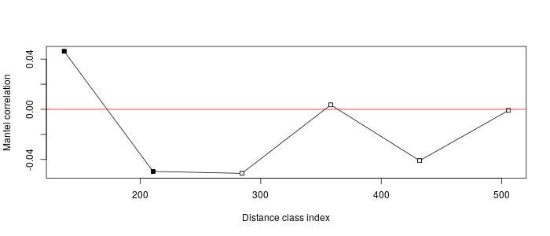

# Introducción
La isla Barro Colorado (BCI) es un área natural localizada en el lago Gatún del canal de Panamá que los cientificos la han dedicado al estudio de bosques tropicales, de fauna y flora. Desde su creación ha sido usada como centro de investigación, útil para hacer proyectos de investigación. 

Cuenta con una vegetación de bosque tropical húmedo semi-perenne, propio de climas húmedos tropicales. La mitad de la isla se encuentra cubierta de bosque jóven de 100 o más años de edad, el resto está cubierto de bosque viejo, el cual ha sufrido muy pocas perturbaciones en los últimos 400 años [@moreno2012ambito]. Se caracteriza un promedio anual de temperatura de 27$^{\circ}$ C en áreas abiertas, con una variación diurna de 9$^{\circ}$ C. Tiene una precipitación promedio anual es de 2,600 mm, con una estación lluviosa que va de mayo a diciembre, y una estación seca que comprende los meses restantes. Está constituida por un total de 265 especies de plantas, y cada una pertenece a una familia.Su flora es considerablemente más rica en relación con el tamaño de la isla  [@croat1978flora]. 

Dentro de su amplia variedad de familias de plantas se encontran las Malvaceae. Esta perteneciente a la familia de las Malvales, con flores dicotiledóneas, que consta de aproximadamente 244 géneros con aproximadamente 4225 especies, distribuidas en regiones tropicales a templadas.

Son plantas de hierbas, arbustos o árboles, generalmente con pelos estrellados. Los tallos son de fibra de líber robusta con cavidad de mucílago. Las hojas son simples, alternas,  palmadamente divididas, palmadas veteadas, con estípulas y pecioladas. Las flores son actinomórficas, solitarias, fasciculadas o dispuestas en cimas o panículas con sépalos de 3 a 5, libres o connatos y valvados. Los pétalos son cinco, libres, giratorios, adnados a la columna estaminal en la base. Los estambres son numerosos, filamentos connados en tubos, conocidos como adelfos[@xu2017malvaceae].(ver figura 1)

{width=30%}


El objetivo de este estudio es identificar la abundancia y la riqueza de esta familia de plantas; analizar su asociación y que influye para que se de dicha asociación. Conocer el método más eficiente para evaluar los dendogramas, evaluar la homogeneidad de promedios entre sitios de especies. De igual manera identificar el patrón y los factores ambientales que intervienen en su distribución. Finalmente integrando la ecología numérica analizar la autocorrelación espacial entre variables. 

La mayor parte del trabajo de se desarrolló en entorno al lenguaje de programación R, en el cual se efectuaron los análisis de agrupamientos, ambientales,ordenamiento y de ecología numérica, apoyandose con paquetes como tidyverse junto con dplyr y vegan con la cual se crearon las matrices de comunidad ambientales. Con el paquete simple Features (sf) se crearon cuadros por hectareas para asi obtener la densidad de cada especie. Asimismo, aunque en menor medida se emplearon los paquetes adespatial, vegetarian, broom y cluster. También fueron usados los paquetes ez para la correlación entre variables y paquetes ggplot2, mapview y graphics para la representación gráfica. Por último, los datos se obtuvieron a partir del repositorio de ecología númerica de José Martinez Battle [@jose_ramon_martinez_batlle_2020_4402362](2020).

Para el desarrollo de este estudio se han formulado las siguientes preguntas:

¿En qué zona se encuentra una mayor abundancia y riqueza de especies?¿y Por qué?

¿Cuáles elementos influyen para la asociación entre especies?

¿Cuál es el método apropiado agrupar las especies en forma de dendograma?

¿Existe una influencia entre las variables ambientales del suelo y la distribución de especies? ¿Cuál es el elemento que más influyente?

¿Existe una influencia entre las variables geomorfologicas y la distribución de las especies?¿Cuál es la variable que más influye?

¿Existe una autocorrelación entre variables?

¿Cuáles son las especies y elementos con mayor autocorrelación?


# Metodología
El estudio se realizó en la Isla de Barro Colorado (BCI), localizada  entre los 9$^{\circ}$ 09’ N y 79$^{\circ}$ 51’ W, que forma parte del Monumento Natural de  Barro  Colorado  (5,500  ha,  Leigh,  1999).  Es  una  isla formada en 1914, cuando se represó el Río Gatún como parte del  trabajo  para  la  creación  del  Canal  de  Panamá {moreno2012ambito}. Es una Zona administrada por el Instituto de Investigaciones Tropicales del Smithsonian dedicada a investigaciones científicas.

Dentro de Isla se encuentra la parcela de 50 Hectáreas que tiene 1,000 metros de largo y 500 metros de ancho lo que da un total de 50 ha que se subdivide en 1 ha. En esta se llevó a cabo nuestro estudio.(ver Figura 2)


{width=50%}


En esta primera parte del trabajo se hace un análisis ambiental de asociación estadística con los datos pre-censales de la parcela de BCI. Usando una matriz de comunidad convertidas en columnas de hábitats para generar mapas de abundancia por especie, abundancia de la comunidad, abundancia de riqueza numérica de toda la comunidad. Es importante resaltar que antes de se cargaron los paquetes para generar las tablas en R y gráficos.

Con la transformación de la matriz de Hellinger, se midió la asociación de distancia entre sitios; utilizándose la similaridad o la disimilaridad de Jaccard se obtuvo una matriz de distancia de comunidad transformada a la cuál se le calculó su distancia Euclidea. Esta distancia Jaccard indica que mientra mayor distancia menor similaridad, es decir, mientras más crece la distancia el parecido entre los sitios es cada vez menor. De este mismo modo para análisis de asociación se usaron las métricas de modo Q y R; con el coeficiente de correlación de Pearson que mide la relación estadística entre dos variables.

La segunda parte del trabajo se basó en el análisis de agrupamiento. Con el fin de comprobar el método más adecuado se utilizaron los métodos de enlace simple (se usa distancia mínima), completo (se usa distancia máxima) y UPGM (media entre valores de distancia mínima y máxima) y WARD basados en el criterio de correlación cofenética, que consiste en la aproximación entre la distancia cofenética y la matriz de distancias Euclideas.De esta manera con los valores de abundancia de especie junto con el método de varianza mínima de agrupamiento de Ward se va construyendo un árbol dentrítico tomando el criterio de la técnica de anchura de silueta (por el método WARD y UPGMA),que refleja los cortes del arbol en varios grupos usando la posición que ocupa el promedio más alto. En este caso el valor de anchura promedio fue 2 con 3 sitios. Con la finalidad de obtener resultados más fiables se usó el reemuestreo de boostrap multiescalar que permite resolver problemas relacionados con la estimación de intervalos de confianza o la prueba de significación estadística [ledesma2008introduccion].

Con la prueba T de Student, y la prueba no paramétrica de la suma de rangos de Wilcoxon (medianas), se evaluaron la homogeneidad de medias y medianas para dos grupos usando como variable de agrupamiento los grupos establecidos en el agrupamiento UPGMA y Ward. Estas sirvieron para hacer una correlación con los resultados de abundancia global y riqueza.

Mediante el análisis de especies indicadoras de Indval se obtuvieron las especies consideradas como indicadoras y un análisis de especies con preferencia por hábitat por medio del coeficiente de correlación biserial puntual. 

Dentro del análsis de agrupamiento, se realizó la ordenación simple (no restringida) usando la técnica PCA y la ordenación restringida RDA y canónica con el fin de hacer un escalonamiento de las variables de suelo, con los valores VIF y la distancia entre sitios por el método de ji Cuadrado.

Análisis de diversidad

Esta tercera parte se basó en el análisis de diversidad (Alpha y Beta) donde se determinaron dos componentes principales; la riqueza y equidad. Por medio de la entropia de Shannon y la antripia de Simpson se medió el indice de equidad de Pielu para la diversidad Alpha.En el análisis beta se busca la equidad usando la aproximación de Whittaker, asociada a los números de Hill y la ratio. Se identificaron las especie y sitios que contribuyen a la diversidad beta. Al final el método de la rarefacción se utilizó para poder estimar combinaciones se utilizaron las métricas de la entropia de Renyi generaliza para obtienen los números de diversidad de Hill.

Ecología numérica

En esta última parte del trabajo se realizaron análisis de vencidad, de autocorrelación espacial mediante correlograma de puntos y de correlación.Así las técnicas aplicadas fueron la de mantel para determinar la correlación entre dos matrices de distancia y determinar autocorrelación mediante la prueba de permutación para I de moran, utilizando los denominados Lisa. 


# Resultados

La familia de plantas Malvaceae cuenta con una cantidad de 3,792 individuos dentro de esa parcela de 50 Hectareas (Ver Tabla 1).En promedio la cantidad de especies por hectarea ronda en torno a unas 8 individuos.A simple vista en la figura presentada más abajo la especie más abundante del conjunto es "Quararibea asterolepis" y guarda una similaritud con el resto de las especies (Ver figura 3).


| Especies de planta       |Cantidad 
|--------------------------|---------|
|Quararibea asterolepis    |2171     | 
|Herrania purpurea         |542      |          
|Apeiba membranacea        |308      |              
|Luehea seemannii          |215      |              
|Hampea appendiculata      |191      |              
|Guazuma ulmifolia         |74       |
|Ceiba pentandra           |62       |
|Sterculia apetala         |53       |
|Apeiba tibourbou          |50       |
|Pseudobombax septenatum   |42       |
|Cavanillesia platanifolia |36       |
|Pachira sessilis          |18       |
|Theobroma cacao           |16       |
|Ochroma pyramidale        |11       |
|Trichospermum galeottii   |2        |
|Pachira quinata           |1        |

Tabla 1. Abundancia por especies 


{width=90%}


Al evaluar la primera parte del estudio basado en el análisis ambiental se refleja que en la parte oriental de la parcela  existe una mayor abundancia de la familia Malvaceae y una distribución de riquezas máximas concentrada en el borde superior central.(Ver figura 4 y 5). 


{width=60%}


{width=60%}

## Análisis de asociación


En el mapa de calor ordenado (el de la derecha), presenta un clúster gigante en el centro que indica un patrón ordenado de dependencia entre las especies relacionadas. En la diagonal desde "Pseudobombax septenatum" hasta "Apeiba tibourbou" (cuadros de color rosa centrales). También se observan las especies que no parecen asociarse con otras, situadas en los extremos de la diagonal, y relacionadas con otras por medio de valores pequeños de distancia (cuadros azules), como "Theobroma cacao" y "Pachira sessilis".El color rosado indica distancia corta y mientras más cortas los cluster se parecen entre sí.(Ver figura 6). 

{width=90%}

## Análisis de agrupamiento 


{width=90%}

Los dendogramas fueron generados por los métodos de enlaces simple, completos, UGMA y Ward. Estos mostraron cortes desiguales por el método UPGMA, completo y simple donde se abarcó 2 grupos (integrados por múltiples posibles subgrupos); un grupo pequeño integrado por 7 sitios y un grupo grande integrado por el resto. Además de los grupos anteriores, detecto elementos que no forman grupos, es decir, sitios que aparecen aislados del resto, como por ejemplo el 13 y, en algunos métodos, también el 9.

Con el método Ward el promedio de anchura de silueta sugirió dividir el dendograma  en 3 grupos diferentes;un grupo grande y otro pequeño. (Ver figura 7)


{width=80%}

Para la homogeneidad de promedios se evaluaron mediante las pruebas T de Student y la suma de rango de Wilcoxon por el métodos de ward divididas en dos grupos. Estos paneles muestran el promedio entre las variables geomorfológicas y elementos del suelo. El Boro (B), Manganeso (Mn), Nitrógeno (N), y el Ph, P resultaron ser significativamente diferentes en media y mediana; en el caso del relieve la pendiente media resultó tener el promedio más diferente (ver figura 8). 

Mediante el método Indval, se encontraron en total 3 especies que pueden ser consideradas como indicadoras con preferencia de habitats.Especificamente estas especes fueron "Quararibea asterolepis"" como especie asociada al grupo 1, "Luehea seemannii" y "Sterculia apetala" pertenecientes al grupo 2, lo significa que estas especies son  extremadamente importantes en la prueba de permutación.


{width=100%}


## Técnicas de ordenación

En el analisis de correspondencia por el método PCA, al ajustar el PCA a la matriz de comunidad y usando la distancia Ji Cuadrado, se encuentra que muchos de los componentes del suelo se encuentran asociados en las variables de comunidad, algun grado de asociación entre las especies y puede ser que sea un patrón consistente(Ver figura 9).


{width=70%}


{width=70%}

{width=70%}
 
El RDA anterior muestra la colealidad que existe entre las diferentes variables de especies y elementos del suelo.Las especies Hampea appendiculata, Ceiba pentandra, tienen una gran contribucción en diferentes sitios, que se relacionan con el P, N, un poco con el Nitrógeno, en el caso de Apeimenb posee mucha asociación con el Aluminio. "Quaraste" es la que más contribuye al conjunto de sitios más mineralizados. Por otro lado, Fueron excluidas algunas variables por tener el valor  VIF por encima de 10 como es el caso del manganeso (Mg),calcio(Ca) y las coordenadas UTM. A pesar de, habían variables con un alto valor VIF por lo que se optó por conservarlas por razones biogeoquimicas y de asociación (Ver gráfico 10).

De esta misma manera, en el análisis de correspondencia canónica fueron excluidas las especies con menos de 100 individuos (especies raras) de la matriz de comunidad, se convervaron 5 en total, y se excluyeron 11 (Ver gráfico 11).En ambos gráficos las variables aparecen en el mismo lugar salvo algunas especies que desaparecieron en el triplot de CCA por tener menos de 100 individuos. 


## Análisis de diversidad alpha y beta

Se usaron diferentes métricas para medir los principales componentes de la diversidad: abundacia y equidad. Se  hicieron mediante la equidad de Shanon (equidad) y antropia de Simpson (abundancia), con los ratios de hill, junto con los números de entropía de Renyi y la equidad de Pielu. En el panel de correlación las especies presentaron una fuerte asociación en presencia Manganeso (Mg), calcio (K), zinc (Zn), y una altísima correlación con el PH sobre todo en la zona de interfluvios y mayor equidad hacia el Este. Los rojos representan correlación significativa los azules baja.(ver figura 12 y 13)
 
En el modelo beta se determina que "Hampea appendiculata" y "Quararibea asterolepis" son las especies que más contribuyen a la diversidad con 0.18 y 0.14 % (ver tabla 2),mientras que los sitios con mayor contribucción son 13 con 0.12 y 46 con 0.86 % de especies.

En el análisis de rarefacción establece los sitio de mayor y menor diversidad. En los modelos de abundancia de Alpha, el sitio con mayor riqueza es el 30 con 13 especies y el de menor riqueza es el 45 con 5 especies, la abundancia máxima y mínima fuer en los sitios 6 con 127 y 37 con 31, la abundancia en el sitio más pobre fue 123 en el sitio 45, y la abundancia en el sitio más rico fue 110 en el sitio 30.

 
{width=80%}

{width=80%}


Tabla 2. Contribución de las especies en la diversidad Beta 

| Especies de planta   |valor| 
|----------------------|-----|
|Apeiba membranacea    |0.08 | 
|Apeiba tibourbou      |0.07 |          
|Hampea appendiculata  |0.14 |              
|Herrania purpurea     |0.11 |              
|Luehea seemannii      |0.09 |              
|Quararibea asterolepis|0.18 |                


## Ecología numérica


Mediante la pruba de permutación para el I de Moran se probó la autocorrelación entre cada especie de plantas. De acuerdo con el resumen estadistico las especies con mayor autocorrelación fueron Apeiba membranacea, Herrania purpurea y Quararibea asterolepis (ver figura 14). Asi mismo, los elementos quimicos del suelos más represetantivos en la autocorrelación fueron el zinc(Zn) con 0.85%, el potasio(K) 0.74%, el calcio (Ca)  0.69 y el pH con 0.72%.
En cuanto a las zonas geomorfológicas se encuentra una alta correlación en la llanura, en el espolón, en la vertiente y en la vaguada (ver figura 15).

{width=80%}


{width=80%}


{width=70%}

El correlograma muestra que para el nivel de significancia 0.04 para los 200 metros hay autocorrelación espacial de la matriz de comunidad lo que quiere decir que hay autocorrelación a su vez de alguna variable. Esto significa que la posición 1 y 2 son las que se encuentran más autocorrelacionadas mientras que los otros órdenes (parte de los residuos) no existe una relación entre especies.


{width=70%}

Los cuadros rojos es la autocorrelación espacial con valores altos y el azul representa una autocorrelación espacial con valores bajos. Estos clúster LISA muestran que el PH es la variable que mas esta autocorrelacionada lo que quiere decir que ese lugar es muy acido y es significativamente alto. La variable de elevación media esta al norte donde BCI es mas elevada.


{width=70%}

En este caso Quararibea asterolepis tiene valores de abundancias grandes rodeadas de abundancias grandes. Otras especies como Sterculia apetala, Theobroma cacao y Pseudobombax septenatum muestraun un patrón similar aunque en menor medida.


# Discusión

Barro Colorado es una isla biodiversa en el canal de Panamá, considerada como el laboratorio natural más grande del mundo. Dentro de sus multiples variedad de plantas Malvaceae tiene una abundancia de 3,792 especies en total. Dicha familia se distribuye en la parte oriental y sus riquesas máximas se encuentran en el borde superior central.

El suelo en la vegetación puede verse modificado por la topografía, es decir por el grado o extensiónn de la pendiente. La cantidad de agua disponible en el suelo, el PH, la cantidad de nutrientes y la textura del suelo son factores que modifican la pendiente (relieve) y por lo tanto influyen en la distribución de las plantas en los bosques.[@clark2002factores]

En la isla en áreas de tierra firme, el nivel freático puede subir ocasionalmente, y causar periodos excepcionalmente adversos y hata letales para la vegetación [@clark2002factores]. Por tal razón las condiciones climáticas y topograficas influyen en la distribución de las plantas BCI. En el caso de compuestos donde hay escasa correlación puede deberse a un exceso de precipitación o largos periodos de sequía.

Utilizando la métrica de cuerdas se determina que en la mayoria de las especies hay una gran asociación entre ellas, y desde el punto de vista de la distancia Jaccard están muy próximos.
Al analizar por separado, los gráficos de componenetes principales de suelo, los resultados indican que determinados compuestos del suelo estan asociados con especies de la familia.Se destaca la presencia de Hampea appendiculata y Quararibea asterolepis sobre encima de las otras especies de la familia. El PH, Manganeso (Mg), calcio (K), zinc (Zn) resultaron ser los elementos quimicos mas significativos sobre todo en la parte de la vaguada. Apeiba membranacea y Herrania purpurea resultaron con una mayor autocorrelación comprobada mediante la pruba de permutación para el I de Moran. El PH por igual,debido a esto, es una zona con mucha acidez. Esta alta acidez del suelo genera disminución en la disponibilidad de ciertos elementos nutritivos como son el fósforo, magnesio y calcio en aquellos suelos donde suelen ser absorbidos por las plantas, por lo tanto una letalidad más rápida en las plantas.


Por otro lado, tomando en cuenta el criterio de la correlación cofenética y el método de anchura de silueta y luego de haber comparado los 4 métodos se determina que el método más apropieado fue WARD. Solo 3 especies resultaron ser indicadoraras por lo que estas permanecen al momento de hacer un remuestreo.

Los patrones de esta especie de plantas son afectados por los elementos quimicos del suelo, y en menor medida por la topografía de la Isla y estos patrones puede variar a lo largo del tiempo debido al clima y la precipitación. Por esto los grupos más predominantes se desarrollan en zonas húmedas.


# Agradecimientos
Esta investigación se llevo a cabo gracias al profesor José Ramón Maartinez Battle de Biogeografía del área de las ciencias geográficas de la Universidad Autónoma de Santo Domingo (UASD) por tener la iniciativa, propiciar las investigaciones y facilitar las herramientas para este estudio en este mismo orden a la escuela de geografía de la UASD por ser fuente de formación de profesionales en el área de geografía. 

Por igual al Instituto Smithsonian de Instigaciones Tropicales por facilitar los datos recogidos de años en la Isla Barro Colorado. Por último un agradecimiento a la estudiante de Ciencias Geográficas Ana Valera por ayudarme a la redacción de esta investigación.


# Información de soporte

{width=70%}

{width=70%}

{width=70%}


{width=70%}

{width=70%}

{width=80%}


{width=70%}


\ldots

# *Script* reproducible

## Análisis exploratorio de datos.Riqueza y abundancia

````
`r paste (readLines('aed_1:análisis_exploratorio_de_datos.R'), collapse = '\n')`

````
## Análisis exploratorio de datos. Mapas de riqueza y abundancia global de Malvaceae

````
`r paste (readLines('aed_3:mapas_riqueza_y_abundancia.R'), collapse = '\n')`

````


## Análisis exploratorio de datos. Mapas de variables ambientales

````
`r paste (readLines('aed_4:mapas_variables_ambientales.R'), collapse = '\n')`

````

## Análisis exploratorio de datos. Correlaciones entre variables ambientales

````
`r paste (readLines('aed_5:análisis_correlación_variables_ambientales.R'), collapse = '\n')`
````

## Análisis exploratorio de datos. Mapas de variables ambientales por lotes

````
`r paste (readLines('aed_6:Mapas_KML_paneles.R'), collapse = '\n')`
````

## Medición de asociación. Introducción a los modos de análisis Q y R. Modo Q aplicado a la paradoja de Orlóci
````
`r paste (readLines('ma_1:Medición de asociación.R'), collapse = '\n')`
````

## Edición de asociación. Modo Q aplicado a mi familia asignada
````
`r paste (readLines('ma_2:Modo_Q_aplicado.R'), collapse = '\n')`

````
## Edición de asociación. Modo R aplicado a mi familia asignada

````
r paste (readLines('ma_3:Medicion_de_asociación.R'), collapse = '\n')

````


## Análisis de agrupamiento (cluster analysis). Parte 2: Interpretación y comparación de resultados
````
`r paste (readLines('aa_2:analisis_de:_agrupamiento.R'), collapse = '\n')`
````

## Análisis de agrupamiento (cluster analysis). Parte 3: Grupos (clústers), variables ambientales y mapas
````
`r paste (readLines('aa_3:análisis_agrupamientos.R'), collapse = '\n')`
````

## Análisis de agrupamiento (cluster analysis). Parte 4: Especies indicadoras, especies con preferencia por hábitats
````
`r paste (readLines('aa_4:analisis_de_agrupación.R'), collapse = '\n')`
````

## Técnicas de ordenación. <br> Parte 1: Ordenación no restringida. PCA, CA y PCoA
````
`r paste (readLines('to_1:Técnicas_ordenación_1.R'), collapse = '\n')`
````

## Técnicas de ordenación. <br> Parte 2: Ordenación restringida o 'canónica'. RDA, CCA
````
`r paste (readLines('to_2:técnicas_de_ordenación.R'), collapse = '\n')`
````

## Análisis de diversidad. Parte 1: Diversidad alpha

````
`r paste (readLines('di_1:Análisis_de_diversidad_Alpha.R'), collapse = '\n')`
````

## Análisis de diversidad. Parte 2: Diversidad Beta

````
`r paste (readLines('di_2:diversidad_beta.R'), collapse = '\n')`
````

## Análisis espacial de datos ecológicos. Autocorrelación

````
`r paste (readLines('ee:ecología_espacial.R'), collapse = '\n')`
````

